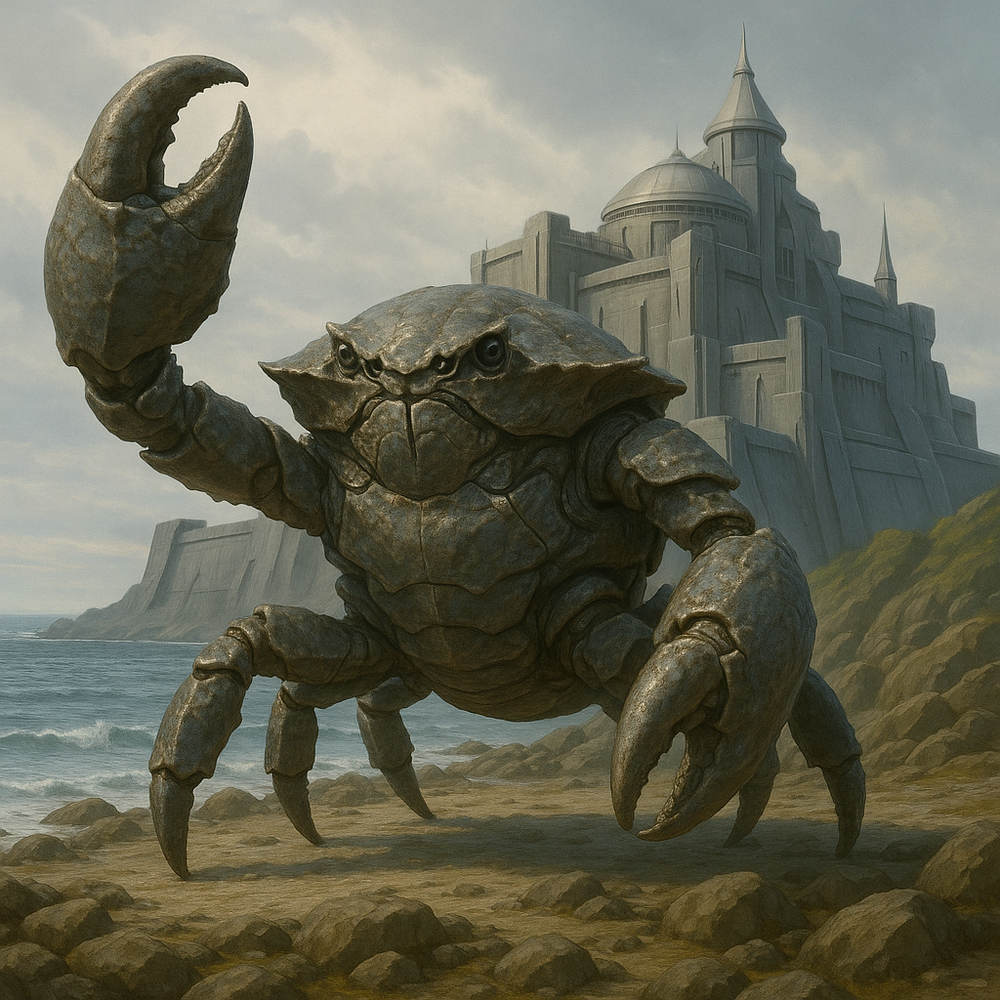

## Nymbrak

### Description:

The Nymbrak are an armored, crablike people clad head to foot in overlapping plates of chitin, their broad bodies carried low on jointed legs and crowned with a pair of formidable pincers that can crack stone as easily as they can thread a delicate pin. For all their martial appearance they are, at heart, builders — their enormous claws are tools first and weapons only reluctantly — and the coastlines of their worlds are lined with the intricate forts and sea-walls for which they are rightly famous. A Nymbrak fortress is a thing of obsessive beauty, every block interlocked without mortar, every passage angled against the tide and the wind, raised by generations of masons who regard a crooked seam as a personal disgrace.

Life among the Nymbrak revolves around the sea's edge, that contested margin where the land they build upon meets the water they fear and respect. Their colonies cling to tidal flats and rocky shores, and their calendar is written in tides rather than days; a Nymbrak speaks of events as happening "two high waters past" and plans its labor around the ebb that bares the foundation stones. They are a cautious, defensive people, forever fortifying against storms, raiders, and the slow hunger of the ocean, and their deepest cultural value is endurance — the quiet pride of a wall that still stands after a hundred seasons of battering surf.

Their most remarkable gift is regeneration: a Nymbrak that loses a limb, even a mighty claw, will slowly grow it anew across a span of seasons, the fresh plate emerging pale and soft before hardening into armor. This capacity has shaped their entire philosophy of patience. Where other peoples fear maiming above death, the Nymbrak shrug at a lost limb as a temporary inconvenience, and their proverbs are full of the wisdom that what is broken can be rebuilt if one is only willing to wait. The same patience that lets them regrow a claw lets them raise a fortress stone by stone over a lifetime, and lets them hold a grudge, or honor a debt, for decades. To rush a Nymbrak is to insult it; good things, they insist, grow back slowly.

### Notable Traits:

- Habitat: Tidal coasts, rocky shores, and estuaries
- Lifespan: 160–200 years
- Strength: Powerful pincers and masterful fortress-building; can regrow lost limbs
- Weakness: Slow-moving on open ground; wary of deep water despite coastal life
- Temperament: Stolid, defensive, and immensely patient

### Fun Fact:

A young Nymbrak's coming-of-age is marked by voluntarily sacrificing a small claw-tip, which it must then regrow unaided to prove its patience worthy of adulthood.

---

*"The wave takes what it will; we have only to outlast it and build again."* — Nymbrak sea-wall mason's maxim

[Back to Aliens](../aliens.md#nymbrak)
