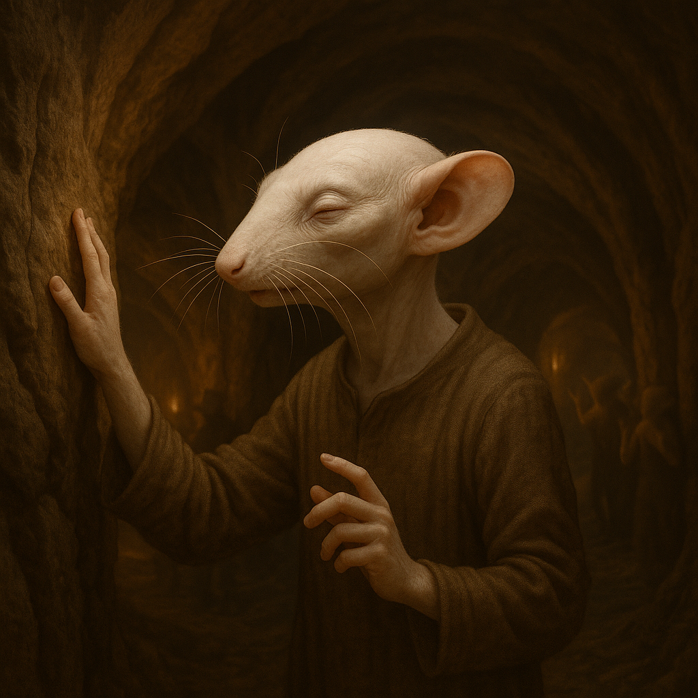

## Nyrreth

### Description:

The Nyrreth are pale, subterranean beings adapted to a life spent far from the sun. Their skin is a translucent, chalky white, their eyes small and nearly vestigial, and in place of sight they rely upon long, exquisitely sensitive **whiskers** that fan from cheek and brow to map the darkness by touch and the faintest stir of air. Lean and low, with spade-like hands for digging, they navigate the lightless warrens of their homeworld with a confidence that would leave surface-dwellers hopelessly lost.

Sound is the Nyrreth's window on the world, and so it is also the heart of their culture. Their most beloved festivals are great celebrations of **sound** — resonant underground concerts of drumming, chanting, and the ringing of stone chimes, where whole communities gather in vast echoing caverns to feel the music thrum through the rock around them. To the Nyrreth, a well-shaped echo is a thing of beauty, and the acoustics of a chamber are judged as other peoples judge a view. They are prolific tunnelers, forever extending vast engineered warrens — mile upon mile of bored, braced, and acoustically tuned passage — and they map these endless tunnels not by sight but by **tapping the walls** and listening to the returning echoes, reading the shape of the dark from sound alone.

This echo-sense pervades their whole way of being. Nyrreth homes are tuned like instruments, their corridors shaped to carry voices clearly between distant chambers, and a skilled "tapper" can navigate miles of unfamiliar tunnel by ear with uncanny accuracy. They are a close, communal, and musical people, finding comfort in the enclosing dark and unease in open, echoless space. Their deepest wisdom holds that nothing is truly unknown — only unlistened-to — and that patience and a keen ear will, in time, reveal the shape of any darkness.

### Notable Traits:

- Habitat: Deep caves, tunnels, and subterranean cities
- Lifespan: 90–120 years
- Strength: Prolific tunneling and construction of vast engineered warrens; echolocation, acute hearing, and masterful underground navigation
- Weakness: Nearly blind and distressed in open, bright, or silent surroundings
- Temperament: Communal, musical, and attentive

### Fun Fact:

A Nyrreth can walk unerringly through miles of pitch-black, unmapped tunnel, guided entirely by tapping the walls and listening to the echoes return.

---

*"Nothing is unknown — only unlistened-to."* — Nyrreth proverb

[Back to Aliens](../aliens.md#nyrreth)
