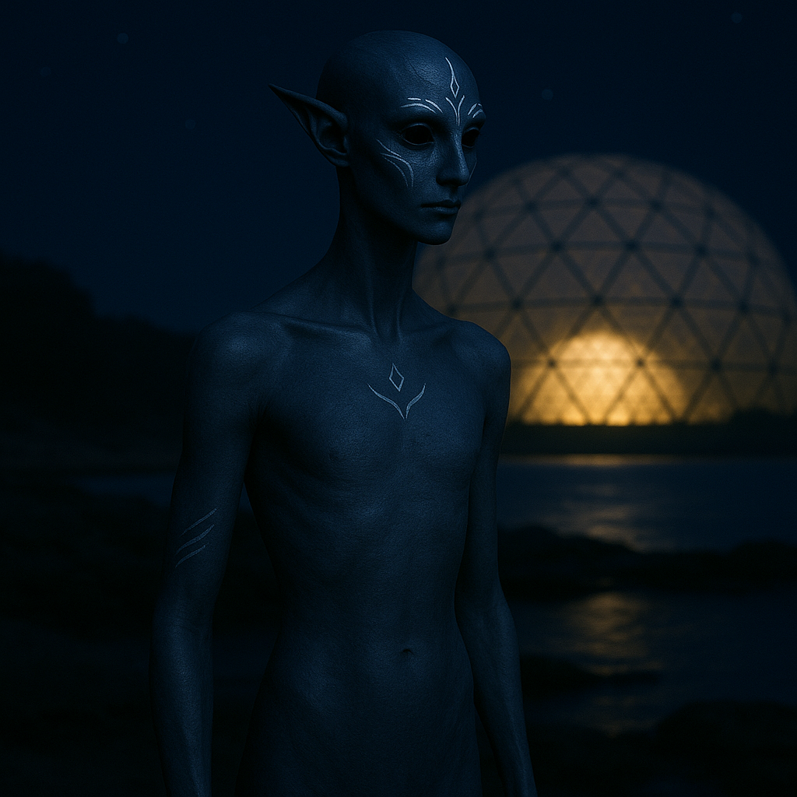

## Nyssarion

### Description:

The Nyssarion are tall and slender humanoids whose dark skin is traced with faint silver markings that catch the moonlight like veins of precious ore. These patterns are unique to each individual, said to be the map of their inner thoughts made visible, and they brighten subtly when a Nyssarion is at peace. Nocturnal by nature, they possess wide, pale eyes suited to starlight and gloom, and they move through the dark with a floating, almost soundless grace that unsettles those accustomed to noisier company.

Theirs is a civilization built on stillness. The Nyssarion rise at dusk and conduct their lives in the quiet hours, believing that the clamor of day scatters the mind while the hush of night gathers it. Their cities are muted places of smooth, dark stone and shadowed courtyards, where even commerce is conducted in whispers and gesture. Loud speech is considered not merely rude but spiritually damaging, a kind of pollution that drowns out the subtle truths only silence can reveal. Children are raised to treasure the pause between words as much as the words themselves.

At the heart of Nyssarion belief lies the conviction that silence is the purest form of prayer — that the divine does not speak in thunder but in the vast quiet between stars, and that only a mind emptied of noise can hear it. Their holiest spaces are the Chambers of No Sound, buried deep beneath their cities, where supplicants sit in total darkness and absolute silence for days, seeking communion. Social standing among the Nyssarion is measured by one's capacity for contemplative stillness; their most revered figures are the Silent Elders, who are said to have gone years without uttering a single word, their silver markings grown so bright they illuminate the dark around them.

### Notable Traits:

- Habitat: Twilight forests and shadowed valleys
- Lifespan: 180 years
- Strength: Profound focus and heightened night senses
- Weakness: Disoriented and distressed by loud, bright environments
- Temperament: Serene, introspective, and reserved

### Fun Fact:

A Nyssarion wedding is conducted in complete silence, the couple's silver markings pulsing in unison the only sign the vows have been exchanged.

---

*"The gods never shouted. Why should we?"* — Nyssarion Silent Elder

[Back to Aliens](../aliens.md#nyssarion)
