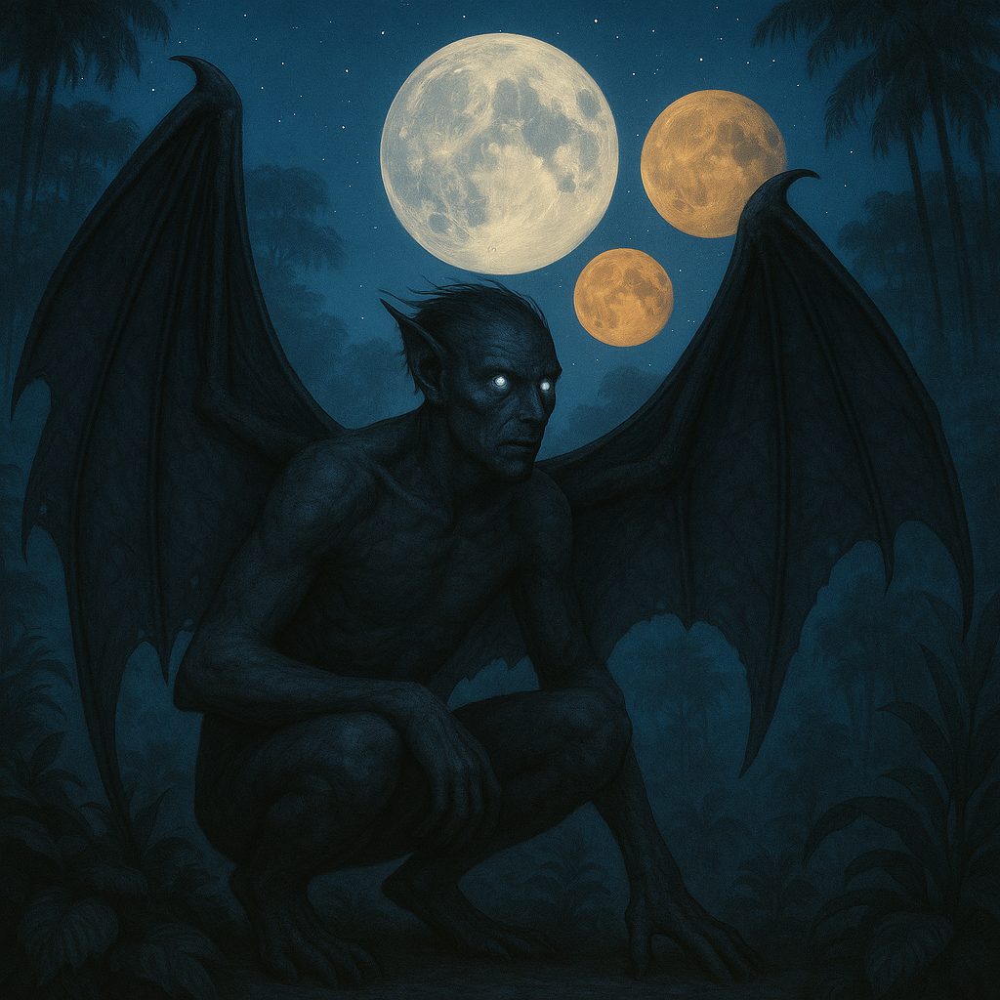

## Nyxathil

### Description:

The Nyxathil are shadowy, winged beings whose bodies seem woven from dusk itself — matte black skin that drinks the light, membranous wings that fold around them like a cloak of night, and large, luminous silver eyes that gleam from the dark like twin moons. They move with eerie silence, their wingbeats muffled, their presence announced only by the faint shine of their gaze. In full daylight they are reluctant and squinting; in darkness they are utterly at home.

For the Nyxathil, darkness is not absence but sanctuary. They hold that the night is the world's truest and most honest state, when pretense falls away and the universe shows its real face among the stars. They keep vigil through the long hours of darkness, watching, meditating, and tending to rites that must never be performed in daylight. The dawn, far from a blessing, is a kind of gentle exile, and the Nyxathil greet it by withdrawing into deep shade to rest until the merciful return of night.

Their most remarkable gift is the ability to vanish into shadow. By drawing in their light-drinking wings and stilling the shine of their eyes, a Nyxathil can melt into any sufficient darkness, becoming all but undetectable. This talent shapes their entire culture: they are watchers from the dark, guardians who move unseen, keepers of secrets that are passed only in whispered blackness. Trust among the Nyxathil is signaled by allowing another to see one's silver eyes in the dark — a deliberate choice to be perceived.

Nyxathil society is quiet, layered, and intensely private, organized into nocturnal "watches" that divide the night among themselves so that some of their number is always awake and vigilant. They speak softly, prize discretion above almost all else, and regard loud, bright, daylight-loving species as faintly vulgar. Yet beneath their aloof exterior the Nyxathil are fiercely protective of those they shelter, and more than one lost traveler has been quietly guided to safety by unseen hands and a pair of silver eyes glinting from the dark.

### Notable Traits:

- Habitat: Caves, deep forests, and the night side of the world
- Lifespan: Long — around 130 years
- Strength: Can vanish into darkness and keep watch unseen
- Weakness: Weakened and half-blind in bright daylight
- Temperament: Secretive, vigilant, and quietly protective

### Fun Fact:

A Nyxathil considers it the highest courtesy to let a guest watch its silver eyes appear from the dark, rather than startling them from nowhere.

---

*"Only in the dark do we see things as they are."* — Nyxathil night-watch creed

[Back to Aliens](../aliens.md#nyxathil)
