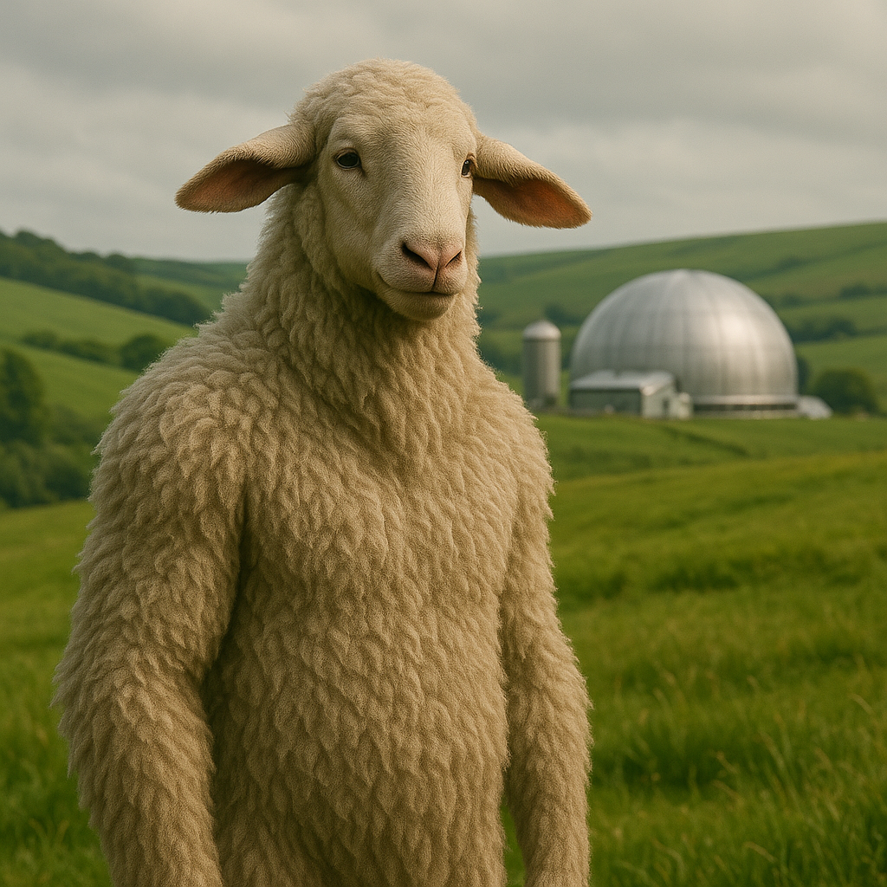

## Obrahn

### Description:

The Obrahn are gentle giants, towering and barrel-chested, their massive frames wrapped in thick, curling wool that ranges from cream to soft slate. Great expressive ears frame their broad, kindly faces, swiveling and folding to convey emotion as eloquently as any voice, so that an Obrahn's mood is written plainly for all to read. For all their size and evident strength, they move with a careful, unhurried gentleness, forever mindful of the smaller and more fragile creatures around them.

At the center of Obrahn life stands the principle of the Common Hold: that all things belong to all, and that to hoard is to wound the whole. In an Obrahn community nothing is truly owned; food, shelter, tools, and labor flow freely to wherever need is greatest, distributed by quiet consensus and a bone-deep instinct for fairness. A hungry Obrahn need only be hungry to be fed; a weary one need only be weary to be sheltered. They find the very notion of private wealth bewildering and faintly sad, a kind of self-imposed loneliness, and their greatest shame is to have let a neighbor go without while one had plenty.

Their voices are low and resonant, capable of a deep, droning song that carries for miles and that has a remarkable calming power — anxious beasts settle, frightened children quiet, and even rival peoples find their tempers cooling in its warmth. The Obrahn use these soothing-songs to tend their vast herds, to comfort the dying, and to mediate disputes, and they revere the Great Chorus, a belief that all living things share one slow, underlying song that it is their sacred duty to keep in harmony. Patient, generous, and almost impossible to anger, the Obrahn are the peacemakers of the stars, trusted even by those who trust no one else.

### Notable Traits:

- Habitat: Rolling grasslands and highland pastures
- Lifespan: 150 years
- Strength: Calming song; immense gentle strength; radical generosity
- Weakness: Slow to defend themselves; easily taken advantage of
- Temperament: Gentle, communal, and endlessly patient

### Fun Fact:

An Obrahn lullaby has been known to calm not only its own young but entire stampeding herds — and, on at least one occasion, two warring armies.

---

*"What one of us holds, all of us hold; what one of us lacks, none of us can rest."* — Obrahn creed of the Common Hold

[Back to Aliens](../aliens.md#obrahn)
