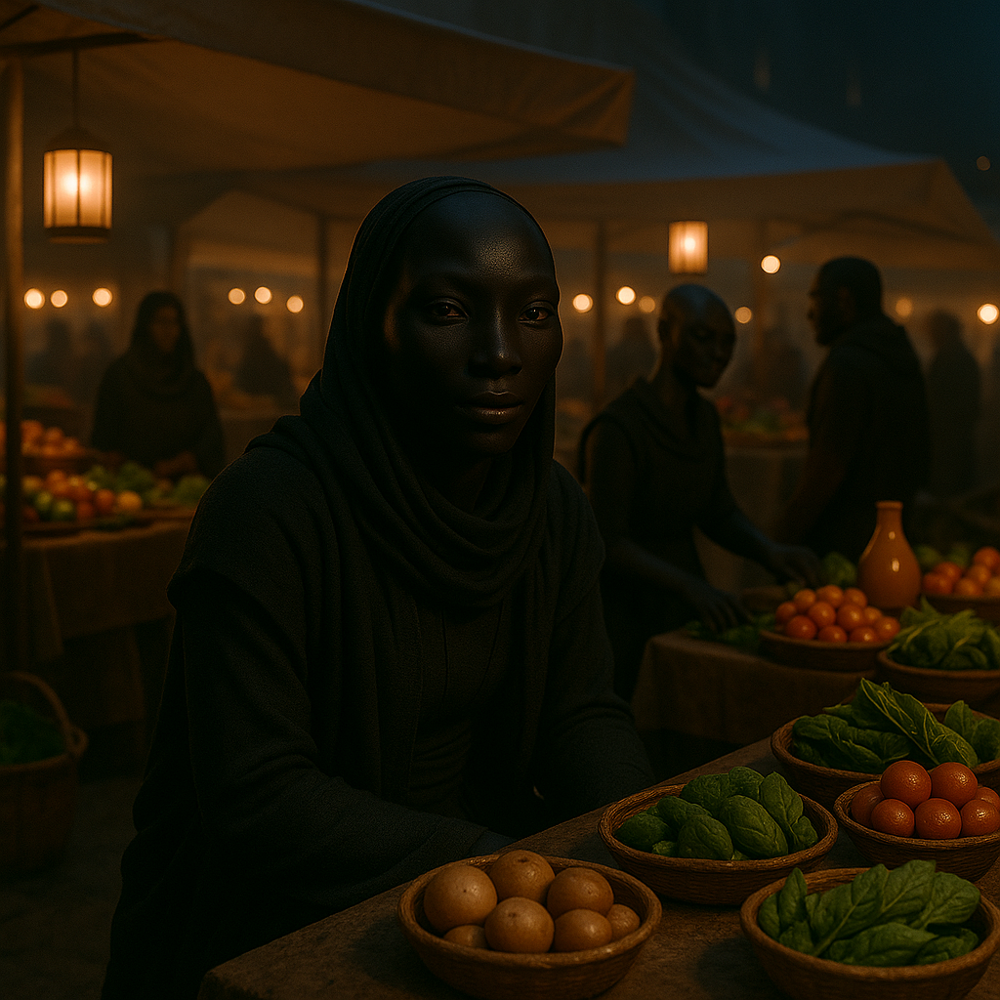

## Ombrayel

### Description:

The Ombrayel are a shadow-born people, their skin a deep and velvety black that drinks the light rather than reflecting it, so that in a dim room they seem less like figures than like absences, like doorways cut into the dark. Their enormous, liquid eyes are the opposite — vast dark mirrors that gather every faint photon and turn near-blindness into clear sight. Evolved beneath the eternal dusk of a world tide-locked against its dying sun, the Ombrayel find bright daylight harsh and bewildering; they move through it squinting and uneasy, and they come fully alive only when the light fails and the rest of the galaxy goes blind.

Their culture is a culture of the night, and nowhere is this more gloriously evident than in their famous night markets. When the pale sun sinks and other peoples retreat indoors, the Ombrayel pour out into lantern-shy plazas lit only by the faintest bioluminescent glow, and they trade, feast, argue, and court in a bustling darkness that would leave an outsider stumbling and robbed. To them the dark is not a danger but a comfort, a shared intimacy; business done by day is thought crude and graceless, and the finest deals, the truest friendships, and the deepest romances are all understood to belong to the hours after dusk. An Ombrayel invited to another's night market has been offered a profound trust.

Because they see so well where others see nothing, the Ombrayel have developed an exquisite sensitivity to subtlety — to the small gesture half-glimpsed, the fleeting expression, the thing not quite hidden in the gloom. Their art favors suggestion over statement, their music is whispered rather than sung, and their politics turn on nuance and implication rather than open declaration. They regard loudness and glare, whether of voice or of light, as the mark of a simple and untrustworthy mind. Yet for all their love of shadow they are not a secretive people among themselves; within the dark they hide nothing, for they know their fellows can see them perfectly well, and it is only to the sun-blind outsiders that they ever seem mysterious.

### Notable Traits:

- Habitat: Twilight worlds, deep caves, and the shaded sides of mountains
- Lifespan: 110–140 years
- Strength: Flawless sight in near-total darkness; keen eye for subtlety
- Weakness: Pained and disoriented by bright daylight
- Temperament: Quiet, perceptive, and nocturnally sociable

### Fun Fact:

The highest compliment an Ombrayel can pay is to say that someone "needs no lantern" — meaning they are honest enough to be trusted in the pitch dark.

---

*"Light shows you only what it chooses; the dark shows you everything, if your eyes are brave enough to look."* — Ombrayel night-market proverb

[Back to Aliens](../aliens.md#ombrayel)
