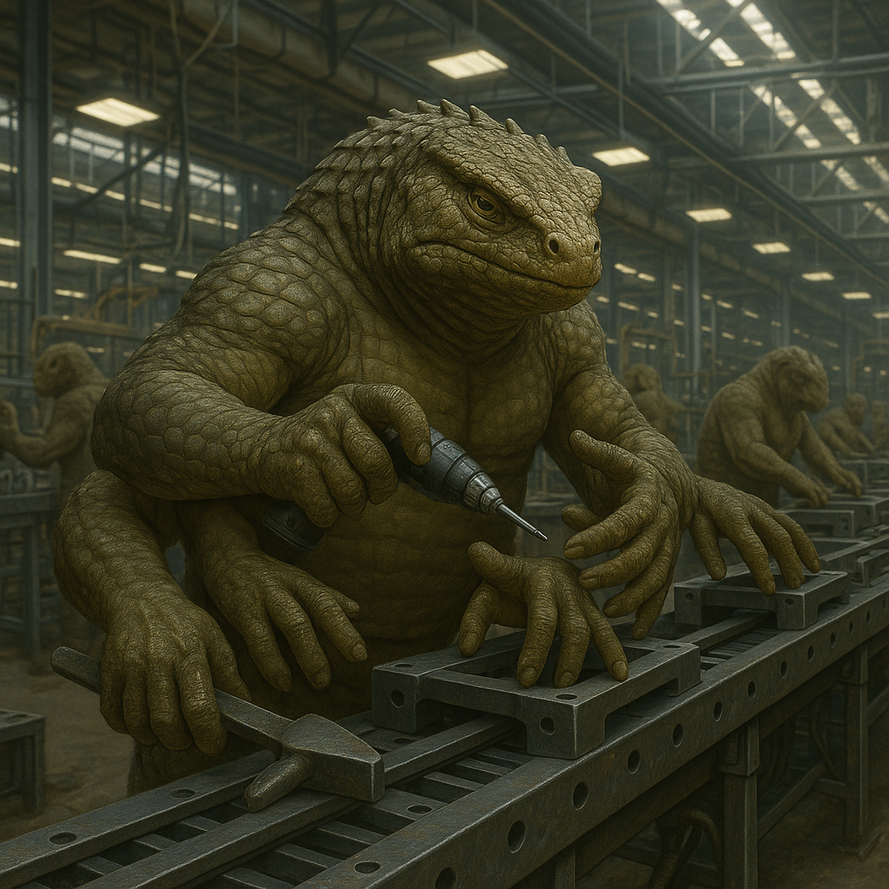

## Onbrakil

### Description:

The Onbrakil are a thick-scaled, many-armed people, squat and immensely strong, their broad bodies plated in overlapping scutes the color of weathered bronze and sprouting four, six, or even eight muscular arms arranged about a sturdy central trunk. They were built, it seems, for labor: each arm ends in a broad, clever hand, and an Onbrakil at work is a marvel of coordinated industry, gripping, lifting, shaping, and fastening with half a dozen tools at once in a blur of patient, tireless effort. Nothing about them is wasted or ornamental; they are a practical people in a practical body, and they find a deep, uncomplicated joy in a hard day's work well done.

Work, in fact, is the organizing principle of their entire society, but it is work shared with a scrupulous and almost sacred fairness. The Onbrakil arrange their labor by rotation: every task, from the honored to the wretched, passes in its turn to every member of the community, so that no one hoards the glory of the fine work nor is forever stuck with the filth of the foul. The one who leads the great building today will haul the refuse tomorrow, and the system is defended with near-religious conviction, for the Onbrakil believe that a society is just only insofar as its burdens and its privileges circulate freely through every pair of hands. Idleness is their one true sin — not because they are grim, but because to let others carry your share is, to the Onbrakil mind, the deepest dishonesty there is.

Their many arms shape their philosophy as surely as their society. The Onbrakil think naturally in terms of many things held at once, of balance and simultaneous effort, and their proverbs are full of the wisdom of the laborer who knows that a load shared across many hands is a load that cannot crush. They are communal to the bone, suspicious of hierarchy and of any individual who sets itself above the rotation, and warmly, gruffly affectionate with one another in the manner of comrades who have sweated side by side. An Onbrakil's highest praise for another is simply that it "pulls its share" — and there is no higher honor in all their tongue.

### Notable Traits:

- Habitat: Quarries, workshops, and the hard-labored lands of hill and plain
- Lifespan: 130–160 years
- Strength: Many powerful arms; can wield several tools at once; tireless workers
- Weakness: Slow and clumsy at fine or solitary tasks; distrustful of leadership
- Temperament: Industrious, egalitarian, and gruffly communal

### Fun Fact:

An Onbrakil greeting involves clasping as many of each other's hands as can be reached at once — a four-armed handshake is considered merely polite, while a full eight-arm clasp is reserved for the dearest of friends.

---

*"No hand is too fine for the filth, and no hand is too low for the glory — the rotation turns for all."* — Onbrakil work-chant

[Back to Aliens](../aliens.md#onbrakil)
