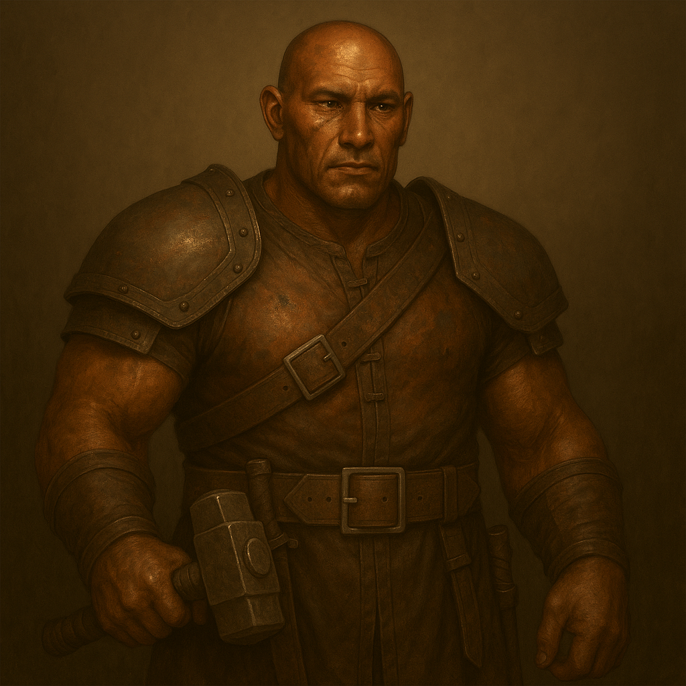

## Osgrim

### Description:

The Osgrim are powerful, upright beings with burnished copper-toned hide and forearms thick from a lifetime at the forge. Their faces are strong-boned and solemn, often marked with the faint scorch-scars and soot-lines of their craft, and their deep-set eyes carry the steady patience of those used to coaxing shape from stubborn metal. They carry themselves with a quiet, formal dignity, every movement deliberate, every greeting bound by the elaborate courtesies of a people who believe that honor is the one thing a warrior can never reforge once it is broken.

Osgrim society fuses the soldier and the smith into a single ideal: the warrior who makes their own weapons and the artisan who knows how to use them. Their communities are industrious and tightly communal, built around great shared forge-halls where the clatter of hammers never truly stops and where young and old labor side by side. Rank is earned through both craft and courage, and an Osgrim's standing rests as much on the quality of the blades they forge as on the battles they win. Above all they live by a strict warrior's code — a web of oaths, debts, and obligations that governs how they fight, whom they fight, and the terms on which they will make peace.

The Osgrim are genuinely aggressive, expanding their holdings through war and taking pride in martial prowess, but they wage war the way they work metal: with care, discipline, and an eye to the lasting result. Because their code binds them, they can be reasoned with where other warlike peoples cannot — an Osgrim will honor a truce, respect a worthy foe, and even forge alliances when oaths are properly sworn, for a broken promise shames them more than any defeat. Their fierceness is real, but it is channeled through ritual and obligation, making them that rarest of things: a warrior-people one can actually bargain with, provided one understands the price of their word.

### Notable Traits:

- Habitat: Forge-hall settlements rich in ore and defensible metalworks
- Lifespan: 120 years
- Strength: Superb weaponsmithing wedded to disciplined, honorable warfare
- Weakness: Bound so tightly by their code that they can be out-maneuvered by the unscrupulous
- Temperament: Aggressive and martial, yet honor-bound, industrious, and open to oath-sworn diplomacy

### Fun Fact:

An Osgrim who breaks a sworn oath must shatter the finest blade they ever forged, for a people who mend metal hold that only honor is beyond repair.

---

*"A blade is tested in fire; a word is tested in time. Guard the second more."* — Osgrim forge-oath

[Back to Aliens](../aliens.md#osgrim)