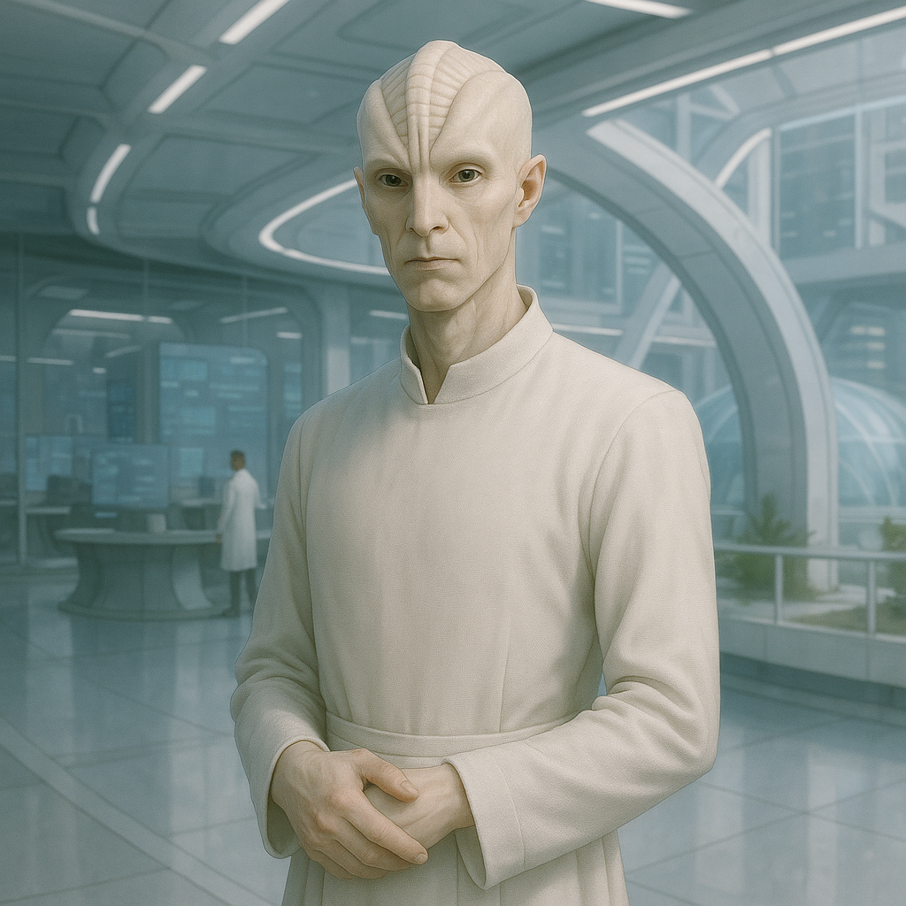

## Ossanther

### Description:

The Ossanther are a tall, pale people, slender and grave, their high foreheads scored with elegant bony ridges that deepen and multiply with age until an elder's brow is a corrugated map of its long years of thought. Their skin is the colorless white of parchment, their movements measured, their voices low and precise, and there is about them always the air of a scholar interrupted mid-sentence and faintly impatient to return to the page. They are a cool, cerebral people who regard the pursuit of knowledge not as a profession but as the only truly dignified reason to exist, and who measure a life's worth by the questions it managed to answer.

Ossanther society is organized almost entirely around learning. Their colonies are built around vast archives and observatories, their cities zoned by discipline rather than by district, and their social hierarchy determined by scholarly accomplishment with a rigor that other peoples find faintly absurd. To be published, to be cited, to have one's correction of a predecessor's error enter the record — these are the Ossanther's true currencies, far outweighing wealth or birth. They are relentless about citation and painfully honest about the limits of their own knowledge; an Ossanther will interrupt its own grand pronouncement to note the single counterexample it has not yet explained, for among them to overstate a claim is a shame worse than to have no claim at all.

Their most uncanny gift is a sensitivity to magnetic fields — the ridges of their brows house delicate organs that let them feel the faint tug and shift of the world's magnetism the way others feel a change in the wind. An Ossanther always knows which way is north; it can sense the approach of a magnetic storm hours before it breaks, feel the buried ore beneath a hillside, and detect the subtle disturbance of a large body moving nearby even in utter darkness. This sense has made them peerless navigators, surveyors, and cartographers, and it has woven itself deep into their philosophy: they speak of truth as a kind of magnetic north, an invisible direction that a disciplined mind can always feel pulling it, however much the surface of things may try to lead it astray. To "lose one's north," in Ossanther idiom, is to abandon reason itself.

### Notable Traits:

- Habitat: Dry highlands and open plains with clear skies for observation
- Lifespan: 200–240 years, the better to finish long studies
- Strength: Sense magnetic fields; unmatched scholars, navigators, and surveyors
- Weakness: Physically frail and socially rigid; paralyzed by incomplete data
- Temperament: Grave, meticulous, and relentlessly curious

### Fun Fact:

An Ossanther in deep thought will slowly turn to face magnetic north without noticing it, so a room full of pondering scholars all drift to point the same way like a bed of compass-needles.

---

*"The honest mind feels truth as the brow feels north — always pulling, never shouting, impossible to fake."* — Ossanther archivist's precept

[Back to Aliens](../aliens.md#ossanther)
