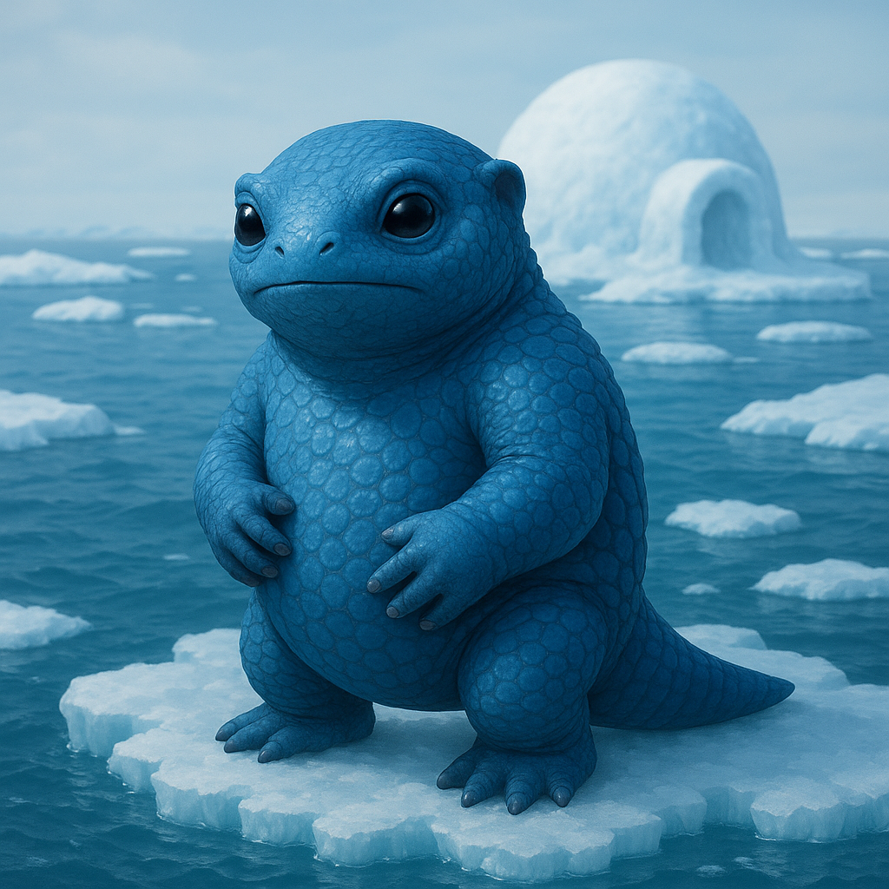

## Osvakim

### Description:

The Osvakim are compact, powerfully built dwellers of frigid seas, clad in dense, blue-scaled hide that glistens like wet sapphire. A thick layer of insulating blubber beneath their scales keeps them warm in waters that would kill most species in minutes, and webbed limbs and streamlined bodies make them swift and sure beneath the ice. Their large, dark eyes are keen in the blue twilight of the polar depths, and they move with the unhurried economy of creatures that have long since mastered a hostile world.

Against the brutal cold, the Osvakim have built a culture of warmth — quite literally. They construct elaborate **communal nests**, snug domed shelters of woven kelp, packed snow, and body heat — carefully insulated nest-works threaded with simple waterworks that channel meltwater and keep the warmth in — where entire families huddle close through the long dark seasons. These nests are the center of Osvakim life, places of story, song, and shared warmth, and the greatest virtue among them is the willingness to open one's nest to another against the cold. No Osvakim, they insist, should ever freeze alone.

Their most remarkable gift is the ability to **slow their metabolism** nearly to stillness, entering a deep, dreaming torpor that lets them wait out the harshest and longest of the cold seasons on almost no food. Whole communities bed down together in their nests and sleep through the worst of the dark, waking as one when warmth returns. This great sleep shapes their patient, cyclical view of time — the Osvakim think in long rhythms of waking and rest, hardship and renewal, and face even disaster with the quiet confidence of a people who know that every winter, however long, eventually ends.

### Notable Traits:

- Habitat: Icy seas, polar coasts, and frozen depths
- Lifespan: 110–150 years (longer counting their deep-torpor seasons)
- Strength: Cold immunity and metabolic torpor for surviving long, harsh winters; builders of elaborate insulated nest-works and simple waterworks
- Weakness: Sluggish in warmth; overheats easily in temperate climates
- Temperament: Warm-hearted, patient, and resilient

### Fun Fact:

An Osvakim can slow its heartbeat to a few beats per minute and sleep away an entire winter, waking at the first thaw as if no time had passed.

---

*"Share the nest, and no winter is too long."* — Osvakim proverb

[Back to Aliens](../aliens.md#osvakim)
