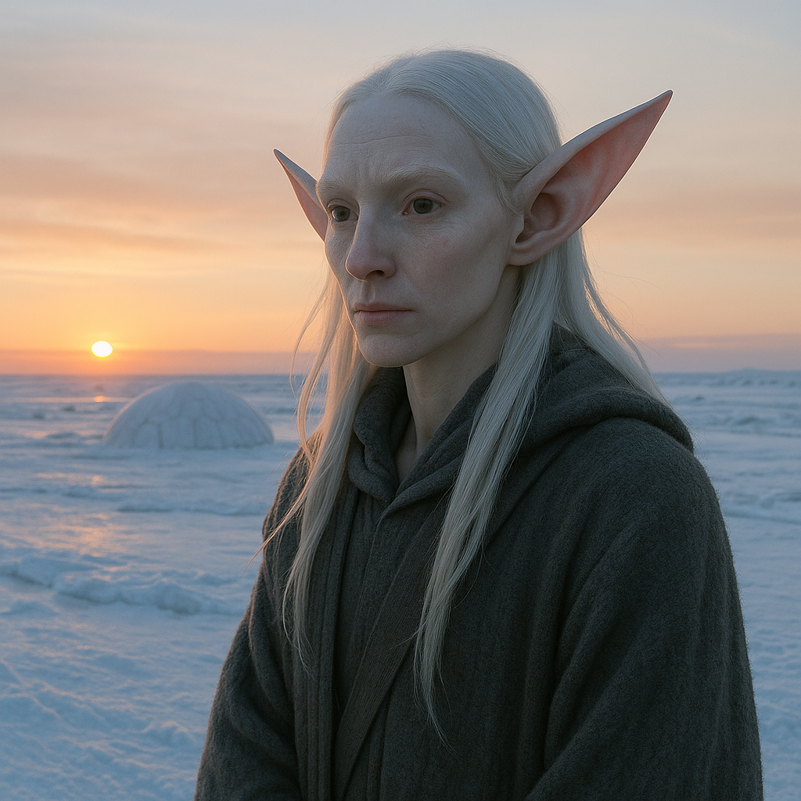

## Oxilune

### Description:

The Oxilune are pale, long-eared beings adapted to the dim, icy worlds at the far edge of warmth, where the sun is a distant, feeble lamp and winter stretches across years rather than months. Their skin is the soft white of fresh snow, their eyes wide and pale to gather what little light exists, and their enormous, mobile ears sweep the frozen silence for the faintest sound. Lean and long-limbed, insulated by fine downy fur, they move across the ice with a careful, listening grace.

For a people who dwell in near-perpetual twilight, nothing is more sacred than the return of the sun. The high festival of the Oxilune is the Dawnwake, the long-awaited reappearance of the sun above the horizon after the great dark, greeted with weeping, singing, and days of joyous ceremony. Their entire spiritual life orbits this slow pulse of light and dark; they measure their years, their generations, and their very fortunes by the comings and goings of the sun, and a child born in the dark season is thought to carry a special yearning for the light.

In the long darkness, sight fails and hearing rules. The Oxilune's great ears can detect the faint crunch of a footstep across miles of still ice, the crack of shifting glaciers, the breath of an approaching creature long before it comes into view. This gift makes them unmatched sentinels and hunters in conditions that would leave other species helpless and blind, and much of their art, music, and lore is built around sound — the subtle grammar of a world experienced primarily through the ear.

Oxilune society is patient, close, and deeply communal, for in the killing cold survival depends on the warmth of shared shelter and pooled resources. They gather into clan-holds dug into the ice and snow, governed by councils of elders who keep the long reckonings of the sun's cycle. Reserved and soft-spoken — loud noise travels far and dangerously on the ice — they nonetheless harbor a deep, aching capacity for joy that bursts forth each Dawnwake, when a people who have waited through the long dark greet the returning light as if for the very first time.

### Notable Traits:

- Habitat: Frozen tundra, glaciers, and ice-holds of the dim polar worlds
- Lifespan: Long — around 150 years, slowed by the cold
- Strength: Extraordinary hearing that detects distant movement in darkness
- Weakness: Suffers greatly in heat and bright light; sensitive to loud noise
- Temperament: Patient, soft-spoken, and quietly joyful

### Fun Fact:

An Oxilune sentinel can hear a predator's footfall across a frozen plain long before even the sharpest eyes could spot it.

---

*"Through the longest dark we wait; and still the sun returns."* — Oxilune Dawnwake hymn

[Back to Aliens](../aliens.md#oxilune)
