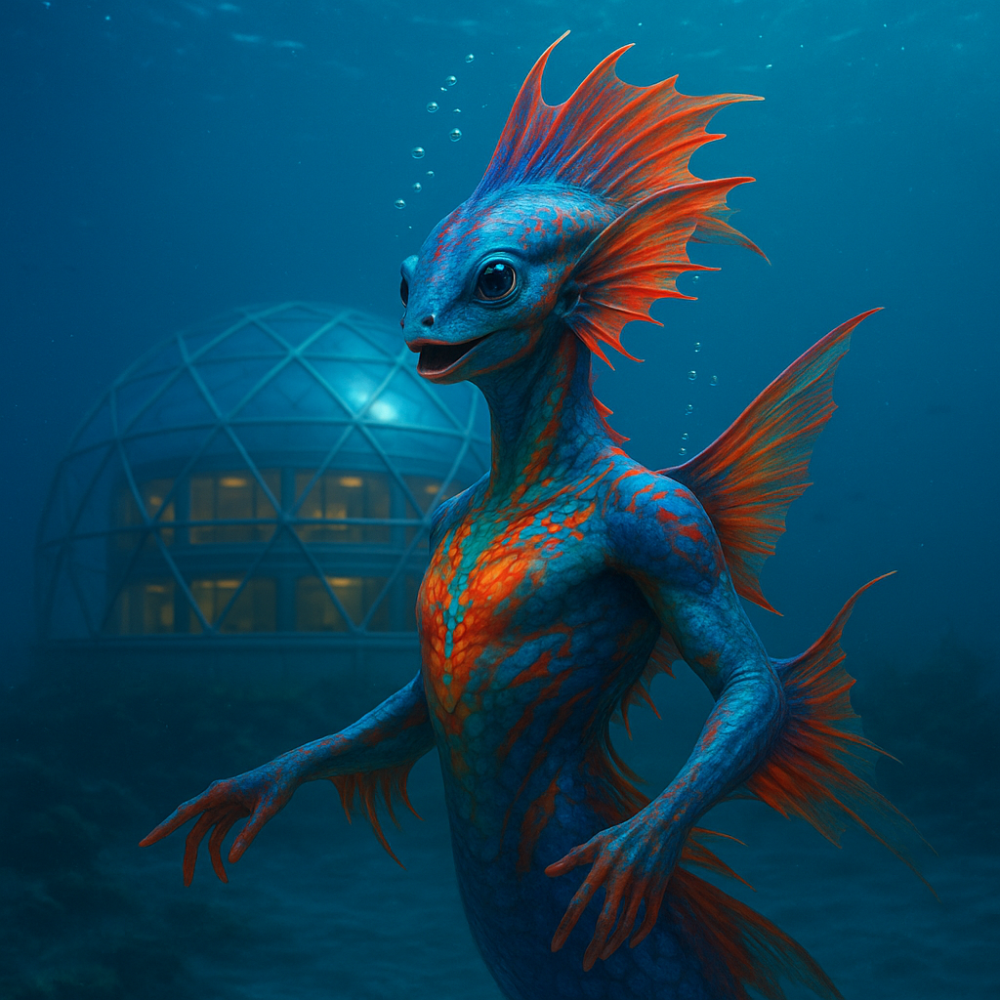

## Ozumara

### Description:

The Ozumara are a dazzling, fin-crested people of the deep ocean, their sleek bodies rippling with bands of luminous color that pulse and flow like living paint. A great translucent crest crowns each individual, flaring in displays of courtship, celebration, and challenge, while sweeping fins propel them through the lightless depths with liquid elegance. In the darkness of their home trenches, the Ozumara are the only light, and they have made of that light an entire language of beauty.

Their cities rise from the abyssal floor in spires of grown coral and bioluminescent glass, glowing softly against the eternal night. To the Ozumara, life is a performance to be celebrated, and no event — a birth, a union, a death, the turning of a current — passes without an elaborate dance. These dances are not mere revelry but the central institution of their culture, encoding history, law, and love in choreographed sweeps of fin and flares of color. A skilled Ozumara dancer can recount the founding of a city or the terms of an ancient treaty entirely through motion, and the greatest honor is to have a new dance named in one's memory.

Because they live scattered across vast, dark depths, the Ozumara communicate over enormous distances through intricate patterns of clicks that carry for leagues through the water. These click-songs weave a web of connection across the entire ocean, allowing distant cities to share news, settle disputes, and coordinate the grand synchronized dances that mark their holiest festivals, when millions flare in unison and the whole sea blazes with light. Their faith celebrates the Current Eternal, the great flow they believe carries all souls, and they hold that a life well-danced is a prayer that needs no words.

### Notable Traits:

- Habitat: Deep ocean trenches and abyssal cities
- Lifespan: 130 years
- Strength: Long-distance click communication and vivid display
- Weakness: Helpless outside deep, high-pressure water
- Temperament: Expressive, joyful, and ceremonious

### Fun Fact:

The grandest Ozumara festival dance spans the entire ocean, with cities thousands of leagues apart flaring in perfect time, coordinated solely by relayed clicks.

---

*"A life unmoved is a song unsung."* — Ozumara dance-master's creed

[Back to Aliens](../aliens.md#ozumara)
