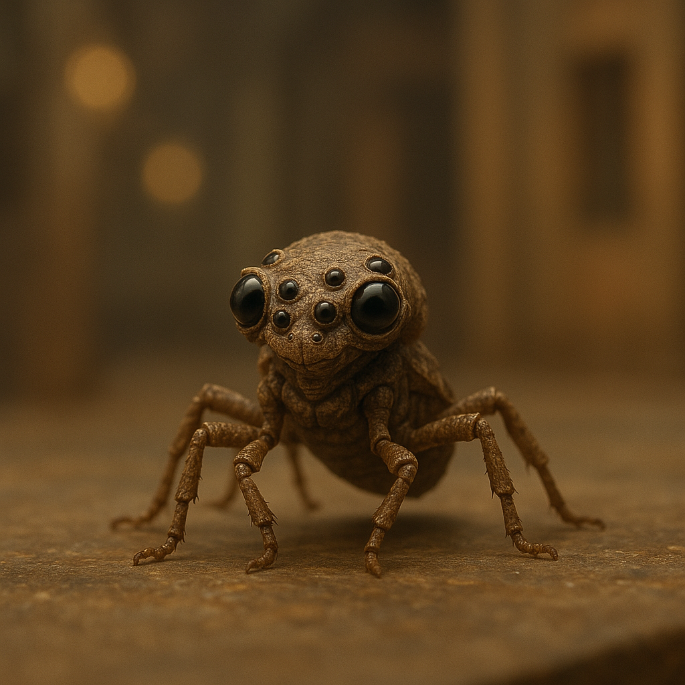

## Ozziketh

### Description:

The Ozziketh are tiny, intricate beings no larger than a cupped hand, their bodies a marvel of jointed limbs and glittering, many-faceted eyes. A single Ozziketh may bear a dozen or more eyes arranged in rings about its head, each tuned to a different quality of light, motion, or heat, and its slender limbs fold and unfold with the precision of fine clockwork. In motion they shimmer, iridescent carapaces catching the light as they skitter and climb across surfaces too sheer for larger creatures.

The Ozziketh are, above all, watchers. Their entire philosophy rests on the conviction that the world reveals its truths only to those patient enough to observe without meddling. When disputes erupt among the larger peoples around them, the Ozziketh neither take sides nor intervene; they simply record, remember, and understand. This is not cowardice but a deeply held creed — that to act hastily is to blind oneself, and that the one who watches longest sees furthest.

Their defining gift is an almost supernatural sensitivity to minute change. An Ozziketh can detect a shift of a single degree in temperature, the faint tremor of a footstep three rooms away, or the precise moment a ripening fruit turns from sweet to sour. Entire Ozziketh professions are built on this acuity: they serve, when they choose to, as unmatched sentinels, diagnosticians, and keepers of records, their testimony prized precisely because they have no stake in the outcome. To an Ozziketh, the smallest detail is never small.

Ozziketh society is a vast, humming lattice of observers organized into "lenses" — collectives that pool their observations into a shared memory far greater than any individual could hold. They communicate in rapid flickers of limb and eye, a language of such density that outsiders perceive only a blur. Reserved, meticulous, and famously neutral, the Ozziketh are courted by every quarrelsome neighbor hoping to win their favor, and endlessly frustrating to all of them, for the Ozziketh will offer their observations to whoever asks politely — and judgment to no one.

### Notable Traits:

- Habitat: Sheltered crevices, hollow trees, and the walls of larger settlements
- Lifespan: Short — about 15 years, but lived in exquisite detail
- Strength: Detection of the faintest changes in their surroundings
- Weakness: Physically frail and unwilling to intervene even when threatened
- Temperament: Observant, neutral, and meticulously reserved

### Fun Fact:

An Ozziketh can tell identical twins apart by the barely perceptible difference in how each one blinks.

---

*"The one who watches the pebble sees the avalanche first."* — Ozziketh lens-saying

[Back to Aliens](../aliens.md#ozziketh)
