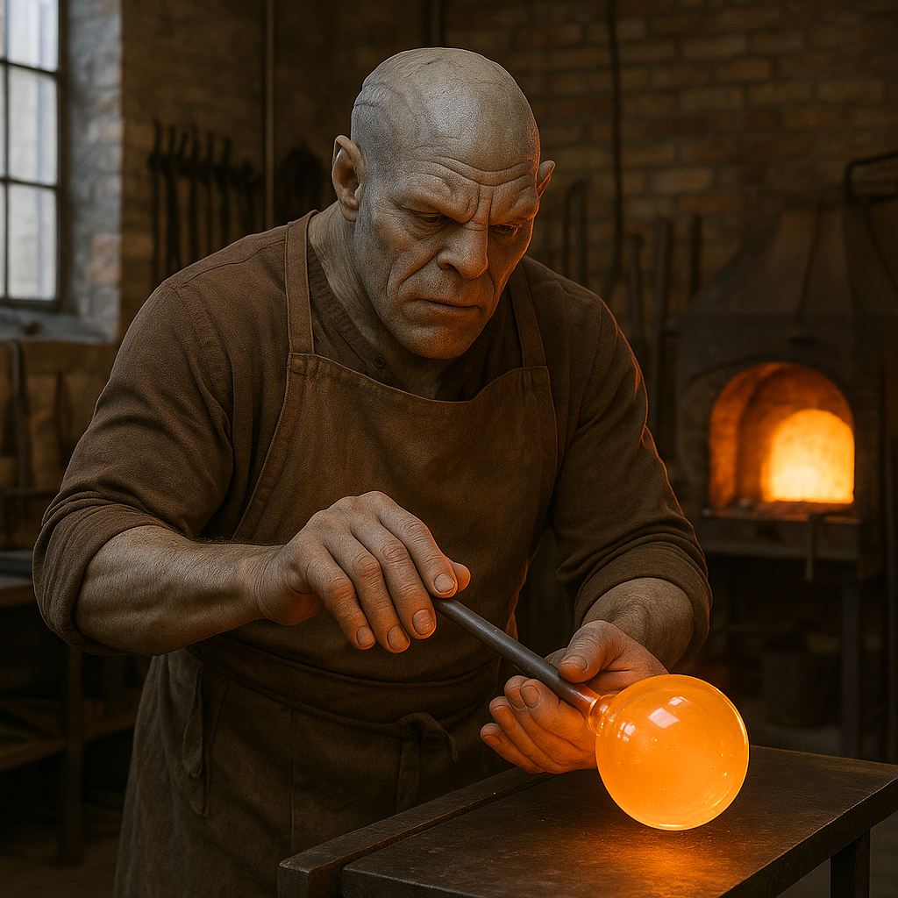

## Perthaan

### Description:

The Perthaan are stocky, broad-shouldered beings built like the stone of the mountains they favor, with thick, calloused hands and a solid, unhurried bearing that speaks of generations spent at the workbench and the forge. Their deep-set eyes carry the focused intensity of craftsmen, and their skin, often dusted with the residue of their trade — stone grit, metal filings, wood shavings — tells at a glance which guild a given Perthaan belongs to. They move deliberately, speak plainly, and regard idle hands as the surest sign of a troubled soul.

To the Perthaan, craft is not merely labor but worship, and their guilds are at once trade schools and temples. Each guild teaches its craft — smithing, masonry, weaving, glasswork, the hundred disciplines of the maker's hand — as a sacred discipline, a lifelong devotion in which technical mastery and spiritual growth are one and the same. A Perthaan apprentice swears vows as solemn as any priest's, and the finest works of the master-crafters are regarded as holy objects, offerings to the divine order of a well-made thing.

This fusion of work and faith shapes everything the Perthaan value. They prize patience, precision, and integrity above all, and they hold that a flaw in one's craft reveals a flaw in one's character. Shortcuts and shoddy work are not merely bad business but minor blasphemies. The highest honor a Perthaan can achieve is to produce a "truework" — a piece so perfectly made that it transcends mere function and becomes an act of devotion — and such masterpieces are passed down for generations and displayed in the great guild-halls as sacred relics.

Perthaan society is a dense interlocking network of guilds, each governing its own craft and sending masters to the councils that govern the whole. Status flows entirely from skill and the respect of one's fellow crafters; birth and wealth count for little against the proof of one's hands. Stubborn, honest, and intensely proud of their work, the Perthaan can be gruff with outsiders and fierce in their standards, but they are unshakably reliable, and a thing made by a Perthaan is understood, across many worlds, to be a thing made to last.

### Notable Traits:

- Habitat: Mountain foothills, mining towns, and great guild-hall cities
- Lifespan: Long — around 130 years
- Strength: Unmatched craftsmanship, patience, and the durability of their work
- Weakness: Stubborn and inflexible; slow to adapt or to trust the untested
- Temperament: Industrious, proud, and gruffly honest

### Fun Fact:

A Perthaan master's truework is said to outlast the hall that houses it, the guild that made it, and sometimes the civilization that commissioned it.

---

*"A thing made well is a prayer that never ends."* — Perthaan guild-oath

[Back to Aliens](../aliens.md#perthaan)
