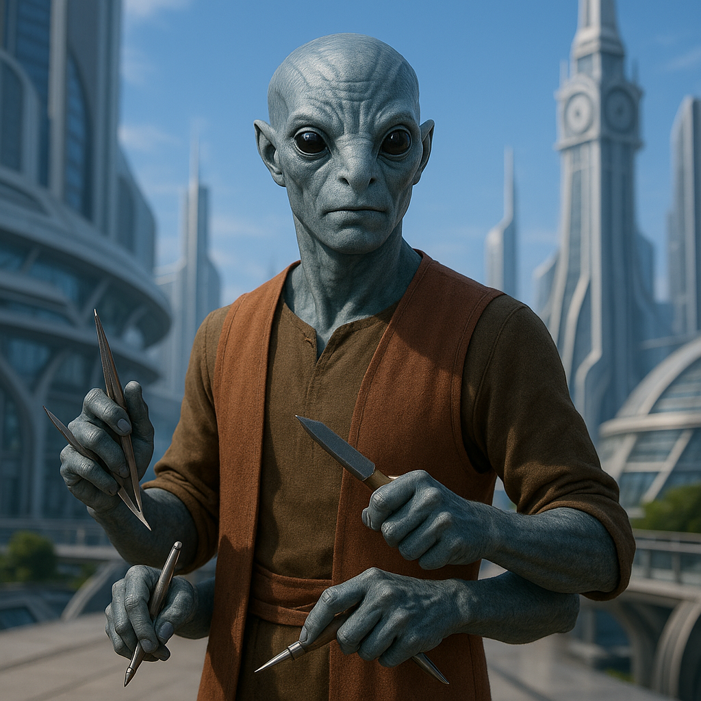

## Pravoxi

### Description:

The Pravoxi are a slender, four-armed people whose every movement carries the deliberate grace of a master at work. Their upper pair of arms is long and powerful, built for reach and leverage, while their lower pair is finer and more delicate, ending in nimble three-fingered hands suited to the most intricate tasks. Set wide across their angular faces are large, forward-facing eyes that grant them exceptional depth perception — a Pravoxi can thread a needle in dim light or judge the fit of two joined surfaces to a hair's breadth without ever reaching for a measuring tool.

Precision is the heart of Pravoxi civilization. To them, a thing done approximately is a thing done poorly, and poor work is a quiet insult to the universe's underlying order. Their cities are marvels of interlocking stonework and seamless joinery, assembled without mortar because none is needed; their textiles are woven in patterns so exact that two garments made a century apart are indistinguishable. A young Pravoxi spends decades apprenticed to a master before being permitted to sign their own work, and the signature itself — a tiny, flawless glyph — is a sacred mark of accountability.

Their four hands make them unlike any other species at the workbench. A Pravoxi artisan can hold, align, cut, and finish simultaneously, performing with a single body what other peoples require whole teams to accomplish. Their tools reflect this: paired implements designed to be used in mirrored motion, jigs that brace with two hands while two others work, instruments with no equivalent anywhere else because no other species has the limbs to wield them. This capacity for simultaneous, synchronized work shapes their entire worldview — the Pravoxi think in parallel, value balance and symmetry, and distrust anyone who rushes.

Socially, the Pravoxi organize themselves into guilds rather than clans, with status earned through demonstrated skill rather than birth. Elders are revered not for their age but for the catalog of flawless work they leave behind, and a master's finest piece is often buried with them as a final testament. They are reserved, exacting, and sometimes maddeningly patient, but their craftsmanship is sought across the stars.

### Notable Traits:

- Habitat: Temperate highlands and stone-built artisan cities
- Lifespan: 110 years
- Strength: Unmatched manual dexterity and precision from four coordinated hands
- Weakness: Perfectionism makes them slow and intolerant of improvisation
- Temperament: Meticulous, reserved, and deeply proud of their craft

### Fun Fact:

A Pravoxi can simultaneously carve, measure, polish, and inspect the same object, finishing in one pass what most species need four separate steps to achieve.

---

*"Measure with all four eyes, cut with all four hands, and the work will outlive you."* — Pravoxi proverb

[Back to Aliens](../aliens.md#pravoxi)
