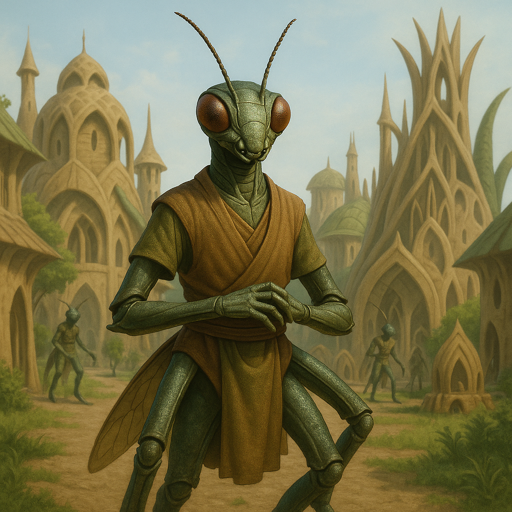

## Praxilon

### Description:

The Praxilon are precise, insectlike thinkers whose segmented limbs fold and articulate with mechanical exactness. Their chitin-sheathed bodies gleam in geometric facets, and their compound eyes register the world as a shimmering mosaic of data. Antennae in constant, delicate motion read the chemical and vibrational signals by which they coordinate, and when a group of Praxilon works together, their movements interlock like the gears of a single vast machine.

Praxilon civilization is organized entirely around **collaborative problem-solving**. They do not think of intelligence as a possession of individuals but as something that emerges between them — a lattice of linked minds attacking a question from every angle at once. Able to process complex patterns at astonishing speed, a gathering of Praxilon can parse a tangle of variables, map its structure, and converge on an elegant solution in the time it takes other species to state the problem. Their great **Solving-Halls** hum day and night with the clicking, humming cross-talk of these collective efforts.

This pattern-mastery shapes their culture into something exacting and beautiful. The Praxilon find deep aesthetic joy in symmetry, structure, and the clean resolution of a difficult puzzle, and they regard a problem well-solved as the highest form of art. Status flows to those whose contributions make a collective solution more elegant, and their customs discourage ego — a brilliant answer belongs to the swarm, not the individual. Patient with complexity and impatient with waste, the Praxilon see the entire universe as one grand pattern awaiting a sufficiently coordinated mind.

### Notable Traits:

- Habitat: Hive-cities, crystalline arcologies, and temperate lowlands
- Lifespan: 60–90 years
- Strength: Rapid pattern processing and unmatched collaborative problem-solving
- Weakness: Struggle with ambiguity, improvisation, and purely individual work
- Temperament: Methodical, cooperative, and detached

### Fun Fact:

A single Praxilon finds a hard puzzle merely interesting; a dozen working in concert can solve it before the first has finished studying it.

---

*"No mind is clever. Only the pattern between minds is clever."* — Praxilon proverb

[Back to Aliens](../aliens.md#praxilon)
