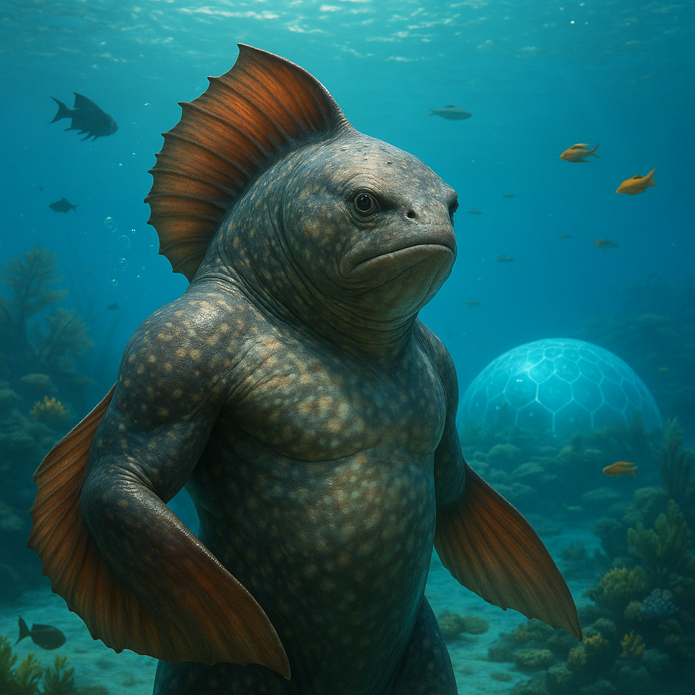

## Qelmarr

### Description:

The Qelmarr are broad-finned ocean dwellers whose mottled, ever-shifting skin ripples with the blues and greens of the shallows they frequent. Powerful pectoral fins fan out like living sails, and a crest of sensory frills along their spines reads the faintest changes in current, temperature, and salinity. On land they move in slow, rolling strides, but in open water they are transformed — swift, tireless, and utterly at home among the great moving rivers of the sea.

The Qelmarr are foremost a people of the **current-roads**. To them the ocean is not trackless but mapped in motion: every eddy, upwelling, and seasonal drift is a known path, and their legendary **navigators** can feel their way across thousands of leagues by current alone, needing neither star nor shore. These navigators hold revered status, for the routes they follow are not merely practical but ancestral — the very paths their forebears swam, passed down and preserved as the sacred inheritance of the people.

The keeping of these routes falls to the **elders**, who are the living libraries of Qelmarr civilization. Through long chants and tactile route-strings knotted to mimic the pull of famous currents, they commit entire ocean-maps to memory and teach them to the young. To forget a route is, in Qelmarr belief, to let an ancestor die a second time. Their culture is thus one of deep memory and continuity, patient and tide-paced, honoring those who came before by faithfully following the roads they first charted through the deep.

### Notable Traits:

- Habitat: Oceans, reefs, and coastal shallows
- Lifespan: 120–150 years
- Strength: Master navigation by reading currents and preserving ancestral routes
- Weakness: Limited and ungainly on dry land
- Temperament: Patient, tradition-bound, and reflective

### Fun Fact:

A Qelmarr navigator can find a specific reef half an ocean away by taste and current-feel alone, with their eyes closed the entire way.

---

*"The sea keeps no walls, yet every road is already drawn — if you know how to feel it."* — Qelmarr proverb

[Back to Aliens](../aliens.md#qelmarr)
