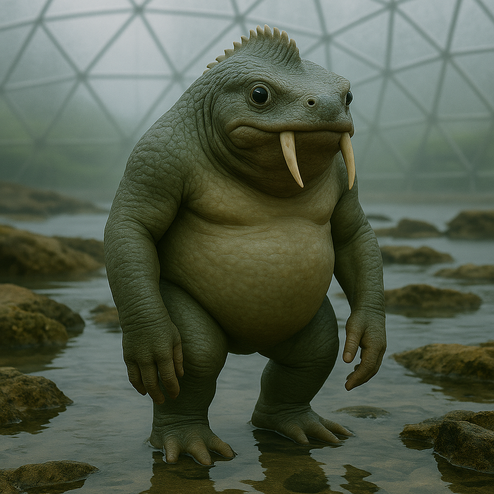

## Qortham

### Description:

The Qortham are a broad, amphibious people, their mottled hides ridged along the spine with a crest of hardened plates that run from skull to tail. Twin tusks curve from their lower jaws, worn smooth and inlaid with shell by those of high standing. Equally at home in surf and on shore, they move with a rolling, deliberate gait on land and with sudden grace in the water. Their skin is permeable and must be kept damp, so no Qortham strays far from the tide for long.

Their cities ring the great tidal pools of their coasts, terraced structures of piled stone and grown coral that flood and drain with the rhythm of the moons; more than most coastal peoples, the Qortham shape these settlements by hand, raising dams and weirs to hold the water they choose and letting the rest run free. Qortham life is governed by these tides as surely as by any law; markets open at low water, councils convene at high, and children are named for the tide under which they are born. Through the water itself the Qortham perceive the world, for their ridged backs are threaded with sensory channels that read vibration across astonishing distances. A Qortham resting in a tidal pool can feel the approach of a storm, the passage of a far-off vessel, or the heartbeat of a kin swimming leagues away.

This gift of deep sensing has made the Qortham a people of patience and attentiveness. They speak little, preferring to drum low rhythms against the water that carry meaning in their patterns, and they consider loud, hasty speech a mark of poor breeding. Their faith venerates the Deep Listener, an ancestral presence they believe dwells in the trenches and hears every ripple ever made. To the Qortham, nothing is truly secret, for all actions send their tremors out into the water, and so honesty is less a virtue than a simple acknowledgment of reality. Their elders are chosen not for strength or wealth but for the keenness of their listening.

### Notable Traits:

- Habitat: Coastal tidal pools and shallow seas
- Lifespan: 120 years
- Strength: Long-range vibration sensing through water; hands-on builders of dams, weirs, and terraced tidal cities
- Weakness: Must keep their skin moist; vulnerable inland
- Temperament: Patient, quiet, and watchful

### Fun Fact:

Qortham diplomats seal treaties by drumming the agreement into a shared pool, trusting the water to "remember" the terms better than any written word.

---

*"The loud wave breaks first; the deep wave arrives everywhere."* — Qortham tide-proverb

[Back to Aliens](../aliens.md#qortham)
