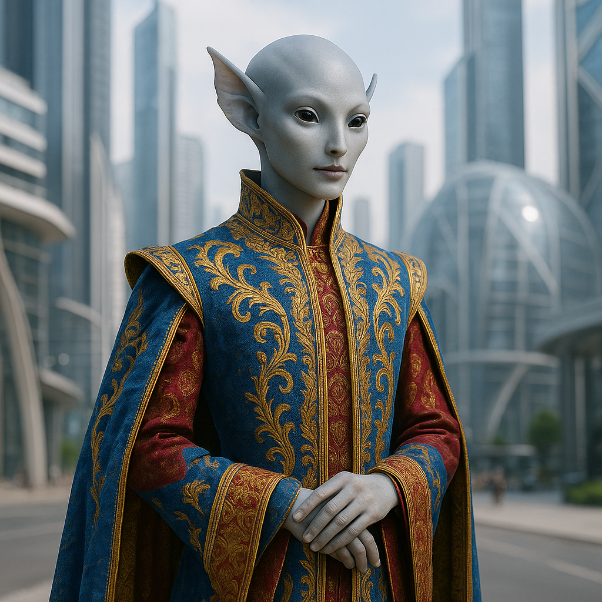

## Quenthaa

### Description:

The Quenthaa are a smooth-skinned, elegant people, their sleek forms untroubled by hair or scale, their most striking feature a pair of broad, translucent fin-ears that fan out from the sides of their heads and flutter gently with every shift of mood. Their skin is a subtle, shifting medium — not the vivid signaling of some species but a quieter language of faint flushes and pales, a softening at the edges of calm, a tightening at the approach of unease. To one who knows how to read it, a Quenthaa's face is an open book written in the gentlest of hands.

Compromise is the cornerstone of Quenthaa civilization. Where other peoples prize victory, the Quenthaa prize the settlement in which everyone yields a little and no one leaves empty-handed. Their proudest cultural institution is the Accord — a formal art of negotiation in which parties circle slowly toward a middle ground, each concession met with a counter-concession, until a balance is struck that all can live with. A Quenthaa raised to maturity has spent years studying the subtle choreography of give and take, and their diplomats are sought across the stars to untangle the knots that stubborn species tie themselves into.

Their quiet skin-signals make them extraordinary mediators. A Quenthaa negotiator reads the room not by guessing but by seeing — the barely perceptible flush of a satisfied party, the pale tightening of someone pushed too far — and adjusts the dance accordingly, steering all sides toward comfort. Among themselves, this transparency breeds patience and gentleness; it is difficult to deceive a people who can see your contentment or distress, and so the Quenthaa have simply stopped trying, building instead a society of soft honesty and endless, graceful accommodation.

Quenthaa communities are consensus-ruled, their councils less about deciding than about discovering the shape of agreement already latent among them. They abhor ultimatums and dead-ends, treating any situation with no room to maneuver as a kind of tragedy to be dissolved rather than confronted. Serene, courteous, and tireless in pursuit of middle ground, the Quenthaa believe that no conflict is truly without a solution — only one that has not yet been patiently enough sought.

### Notable Traits:

- Habitat: Wetland deltas and temperate coastal plains
- Lifespan: 95 years
- Strength: Masterful diplomacy and the ability to read moods through others' subtle cues
- Weakness: Reluctance to take hard stands leaves them vulnerable to the ruthless
- Temperament: Serene, accommodating, and diplomatic

### Fun Fact:

A Quenthaa Accord is considered incomplete until every party present performs a slow fin-ear flutter signaling genuine, visible satisfaction with the outcome.

---

*"The strongest bridge is the one both banks were willing to build."* — Quenthaa proverb

[Back to Aliens](../aliens.md#quenthaa)
