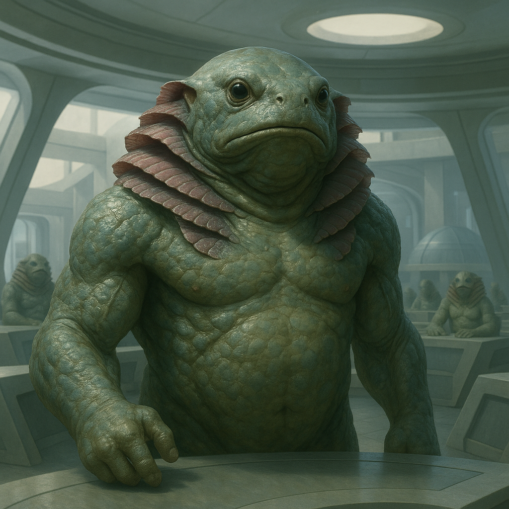

## Quorlath

### Description:

The Quorlath are a broad, amphibious people, barrel-chested and smooth-skinned, their flanks ribbed with layered gills that flutter like gentle fans whether they breathe water or air. Equally at home beneath the waves and upon the shore, they occupy the fertile seam between two worlds, and their whole civilization is built in that in-between place where tide meets land. Their skin is a mottling of greens and silvers that shimmers when wet and dulls when dry, and an elder Quorlath carries the slow discoloration of its years the way a stone carries moss, each patch a mark of some remembered season.

Governance is the Quorlath's great art, and they conduct it in their famous floating halls — vast raft-platforms of woven reed and buoyant wood, moored in sheltered lagoons, where delegates gather from every settlement up and down the coast. The Quorlath are accomplished builders and shipwright-engineers, forever extending these halls, pontoon causeways, and tide-mills until whole floating cities ride the lagoons. A Quorlath council is a thing of ceremony and endless patience: speakers submerge to cool their tempers before replying, decisions require not a majority but a slow-ripening consensus, and a debate may drift across many tides before it settles. They believe, deeply, that any question answered in haste has not truly been answered at all, and that the floating hall must rock gently on the water precisely so that no one forgets how easily a rushed vessel capsizes.

Their dual breath has made the Quorlath a people of bridges — between sea and land, between settlement and settlement, between quarreling neighbors who each trust the amphibious go-between to understand their world. They serve across the continent as mediators, traders, and diplomats, prized for a temperament as cool and even as the deep water they can always retreat into. Yet beneath the diplomat's calm runs a current of fierce communal loyalty: harm one Quorlath settlement and you will find the whole coast quietly closing ranks against you, for the floating halls are many but the consensus they reach is one. Among themselves they are warm, slow-spoken, and endlessly fond of long submerged silences that outsiders find unnerving but which the Quorlath consider the very height of good company.

### Notable Traits:

- Habitat: Coastal lagoons, river mouths, and shallow seas
- Lifespan: 180–220 years
- Strength: Breathe both air and water; superb mediators and consensus-builders; accomplished engineers of floating structures
- Weakness: Slow to decide; vulnerable and dispirited if kept long from water
- Temperament: Calm, deliberate, and diplomatically patient

### Fun Fact:

A Quorlath that wishes to end a conversation politely simply slips beneath the surface — "going down to think" is the gentlest way their language has to say goodbye.

---

*"The current that rushes carves only ruin; the current that waits carves canyons."* — Quorlath floating-hall adage

[Back to Aliens](../aliens.md#quorlath)
