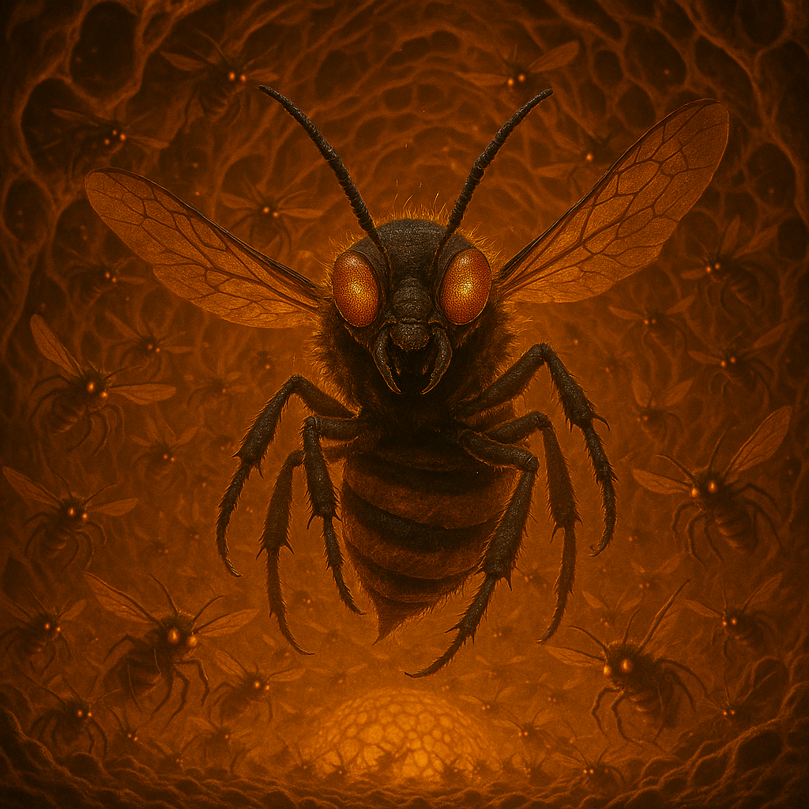

## Qzzik

### Description:

The Qzzik are a swarming insectile people, each individual no larger than a child but never, ever encountered alone. Glossy black carapaces, barbed limbs, and twitching sensory palps mark them as creatures of frantic motion, and their compound eyes gleam with a restless, collective hunger. A single Qzzik is a nuisance; a Qzzik brood-tide is a living storm that strips a world bare and moves on, chittering, before the dust has settled.

Everything about Qzzik culture is tuned to velocity and overwhelming numbers. They breed in explosive pulses, flinging new broods toward any world within reach with no scouting, no caution, and no plan beyond arrival. Half a landing-swarm may perish in the attempt; the Qzzik regard this the way a tree regards fallen seeds. What matters is not the survival of individuals but the ceaseless forward churn of the swarm, which must always be expanding, always consuming, always hurling itself at the next horizon before the current one is even secured. To a Qzzik, standing still is starvation, and planning for tomorrow is a luxury only the slow and the doomed indulge in.

They have no diplomats and no capacity for them. The Qzzik swarm-mind communicates in pheromone shrieks and does not possess the patience, or the interest, to parley with slower species — a negotiator is simply something in the way, to be swarmed over like any other obstacle. Reckless beyond reason, aggressive beyond calculation, and expanding with the blind fecundity of a plague, the Qzzik are feared across the reaches not for their cunning but for their sheer, suicidal relentlessness. You cannot bargain with a tide of teeth, and you cannot outrun one that does not care how many of itself it loses to catch you.

### Notable Traits:

- Habitat: Any world the swarm can reach, briefly, before moving on
- Lifespan: 15 years individually; the swarm is effectively immortal
- Strength: Overwhelming numbers, breakneck expansion, and no fear of loss
- Weakness: Recklessly self-expending; no diplomacy, no restraint, no foresight
- Temperament: Frenzied, voracious, and utterly heedless of danger

### Fun Fact:

A Qzzik swarm will attempt to colonize a world it has not yet finished scouting, reasoning — if it reasons at all — that the survivors will simply figure it out.

---

*"[untranslatable pheromone-shriek — scholars render it only as 'MORE, NOW, FORWARD']"* — the sole recorded Qzzik "statement"

[Back to Aliens](../aliens.md#qzzik)
