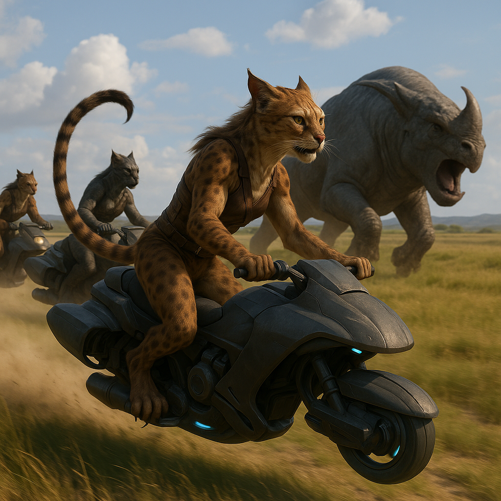

## Ryllakor

### Description:

The Ryllakor are lithe, long-tailed hunters, their sleek muscular bodies built for the chase and crowned with alert, swiveling ears. Their most prized feature is a set of retractable claws, kept sheathed and sharp until the decisive moment of a hunt, and their long, counterbalancing tails lend them extraordinary agility as they bound across broken ground in pursuit of prey. Covered in short tawny fur dappled for camouflage, they are patient, silent, and devastatingly swift when the moment comes.

Yet for all their predatory prowess, the Ryllakor are defined less by the hunt than by what follows it. Their most sacred custom is the sharing of the kill: when a hunt succeeds, every part of the fallen prey is brought back and distributed among the whole community, so that nothing is wasted and no one goes without. Meat, hide, bone, and sinew each find their rightful use, and the hunter who made the kill takes the smallest share rather than the largest, for among the Ryllakor the honor lies in providing, not in possessing. A hunter who hoarded their catch would be shamed beyond redemption.

This ethic of sharing turns the solitary skill of the hunt into the great communal bond of their society. The post-hunt feast is their central ritual, a solemn and joyful gathering in which the community gives thanks to the prey, recounts the deeds of the hunt in song, and reaffirms the bonds that tie them together. To take a life for food is treated with grave respect; the Ryllakor believe that an animal honored by having every part of it put to good use has not died in vain, and they regard waste as the deepest disrespect both to the prey and to the community it feeds.

Ryllakor society is organized into tight-knit hunting bands bound by fierce loyalty and shared need. Status flows to the most skilled providers and the most generous sharers, and leadership falls to those who feed the most mouths rather than those who claim the most trophies. Proud, disciplined, and intensely communal, the Ryllakor live by a creed as old as the first hunt: that strength exists to feed the many, and that the measure of a hunter is how well their people eat.

### Notable Traits:

- Habitat: Open grasslands, savanna, and brushland hunting ranges
- Lifespan: 70 years
- Strength: Swift, agile hunters with retractable claws and keen senses
- Weakness: Uneasy with sedentary life and ill-suited to crowded settled cities
- Temperament: Disciplined, loyal, and communal

### Fun Fact:

The Ryllakor hunter who makes the kill traditionally eats last and least, for among them the giving of food, not the taking, is the mark of true status.

---

*"The hunt feeds one; the sharing feeds us all."* — Ryllakor proverb

[Back to Aliens](../aliens.md#ryllakor)
