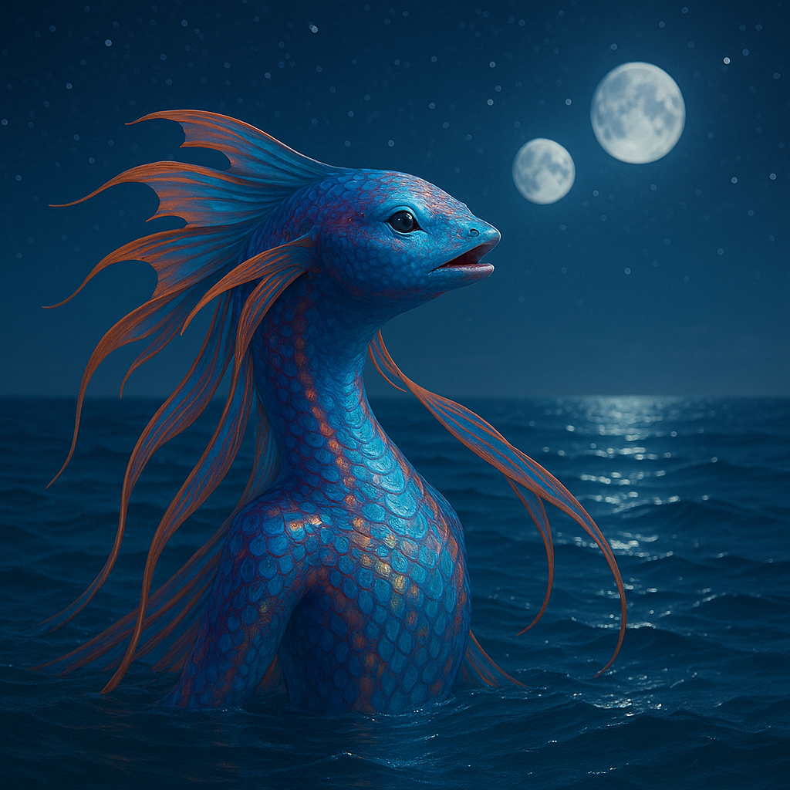

## Selquorra

### Description:

The Selquorra are sleek aquatic beings whose bodies trail long, rippling ribbon-fins that stream behind them like living banners. Their scales blaze in impossible colors — teal shading to magenta, amber flaring into violet — and shift in brightness with mood and current, so that a pod in motion looks like a shoal of underwater fire. They are built for open water, graceful and tireless, surfacing only to breathe and to lift their faces toward the night sky they so revere.

The Selquorra are navigators above all else, and their navigators are revered as the wisest among them. By night they rise to the surface to read the stars not in the sky directly but mirrored and broken in the moving water, a shimmering map that only trained eyes can interpret. From this doubled sky they chart courses across trackless oceans, and a master navigator who can hold the reflected constellations steady in a rolling sea is honored above warrior, builder, or chief. Their star-lore is a sacred inheritance, memorized in verse and jealously guarded.

Song binds the Selquorra together across the vast distances of the deep. Their voices carry for astonishing stretches through open water, and they sing not merely for pleasure but to keep contact, to pass news, and to worship. A pod separated by a hundred leagues of ocean remains a single community through its songs, each voice weaving into a continent-spanning chorus. The greatest of these songs, the Tide-Hymns, are sung by whole migrations at once and are said to be audible to any Selquorra anywhere in the sea.

Selquorra society flows and reforms with the currents, pods merging and parting as they follow the great migrations. Leadership rests with the navigators and the finest singers, and belonging is a matter of voice rather than birth — any Selquorra who knows the songs is kin. Free-spirited and restless, the Selquorra distrust walls, borders, and anything that cannot move, and they regard the land-bound species with a mixture of pity and wonder, unable to imagine a life not shaped by the open, singing sea.

### Notable Traits:

- Habitat: Open oceans and deep coastal waters
- Lifespan: Moderate — around 80 years
- Strength: Peerless navigation by reflected stars and song that spans the sea
- Weakness: Helpless and disoriented away from open water
- Temperament: Free-spirited, lyrical, and restless

### Fun Fact:

A Selquorra navigator can find a single reef in a thousand leagues of empty ocean using only the stars broken on the waves.

---

*"The sky above lies still; trust the sky that moves beneath you."* — Selquorra navigator's maxim

[Back to Aliens](../aliens.md#selquorra)
