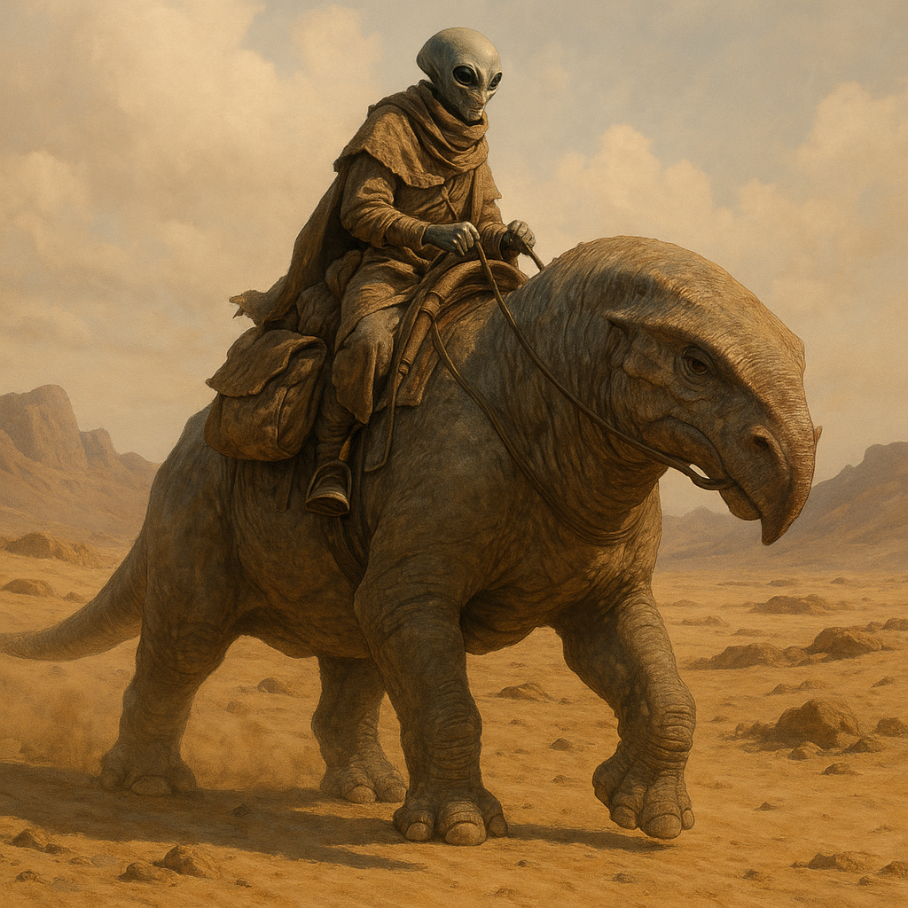

## Serakhuun

### Description:

The Serakhuun are slender, grey-skinned wanderers of the deep deserts, built lean and wiry for a life of endless travel across the dunes. Their most striking feature is their eyes — large, dark, and liquid, protected by a second translucent inner lid that slides across to shield them from blowing sand and the merciless glare of the sun. Loose, layered garments the color of the dust hide their forms almost entirely, so that a band of Serakhuun crossing the sands looks like nothing so much as the desert itself in motion.

The Serakhuun are a nomadic people, and they do not cross the deep deserts on foot but astride the Khaar — massive, beaked beasts of burden with splayed, padded feet and humped backs that store water and fat for the long marches between oases. The bond between a Serakhuun and its Khaar is lifelong and nearly sacred; a rider's beast is partner, companion, and, in the vast emptiness of the sands, often the only other living thing for many days. To lose one's Khaar is a catastrophe mourned as deeply as the loss of a sibling.

Their culture is shaped entirely by the discipline of the open desert, where everything must be carried and nothing can be wasted. The Serakhuun travel light, trade shrewdly at the oasis-towns, and carry their history not in buildings but in long recited genealogies and route-songs that map every well, dune, and danger across thousands of leagues. Hospitality is iron law: no traveler, however strange, is refused water and shade, for all who cross the deep desert understand that today's stranger may be tomorrow's only hope of rescue.

Socially the Serakhuun organize into caravans — tight-knit mobile communities that may merge for a season and part for a decade, bound by marriage, trade, and shared routes. Authority rests with the caravan-masters who know the ways of the sand, and respect is earned by endurance, generosity, and an unerring sense of direction. Reserved with outsiders but warm within the caravan, the Serakhuun are a patient, fatalistic people who have learned from the desert that the land does not bargain, and that survival belongs to those who travel wisely and share freely.

### Notable Traits:

- Habitat: Deep deserts and the oasis-towns strung between them
- Lifespan: Moderate — around 85 years
- Strength: Supreme endurance and navigation across trackless desert
- Weakness: Ill-suited to cold, wet, or enclosed environments
- Temperament: Patient, hospitable, and reserved with strangers

### Fun Fact:

A Serakhuun can judge the distance to the next well by the taste of the wind alone.

---

*"The sand keeps no debts and grants no mercy; only the caravan does."* — Serakhuun route-song

[Back to Aliens](../aliens.md#serakhuun)
