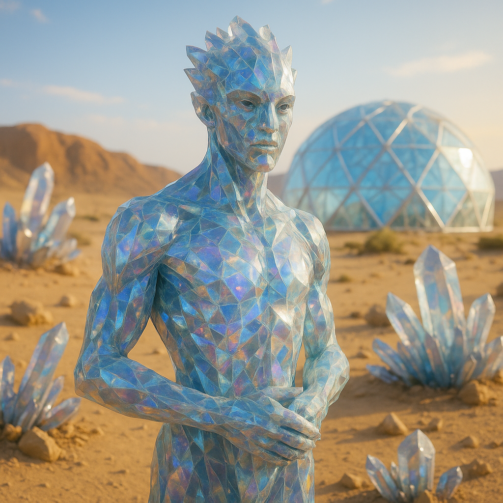

## Sillquith

### Description:

The Sillquith are a people of living crystal, their bodies grown from translucent lattices that catch the light and shatter it into drifting rainbows. No two are quite the same color; a Sillquith's hue is determined by the trace minerals of the ground it grew upon, so that an entire family may share the faint rose of iron-rich stone while a traveler from a distant quarry gleams a cold and unfamiliar blue. In daylight they are dazzling, almost painful to behold, and in the dark they fall quiet and glassy, waiting for the next dawn to wake their colors. Their edges are hard and faceted, their movements deliberate, for a careless fall can chip a limb, and a chip, once taken, never quite grows back the same.

To the Sillquith, stone is scripture. They hold that the deep mineral formations of their world — the great geodes, the banded cliffs, the slow-dripping cave columns — are a written record of all time, laid down crystal by crystal across the ages, and that to read them correctly is to read the mind of the world itself. Their scholars spend lifetimes crawling through caverns, cataloguing strata, interpreting the colors and inclusions of ancient stone as other peoples might pore over libraries. A new vein discovered is a new chapter revealed, and the gravest sacrilege imaginable is to shatter or mine a formation declared sacred, for to do so is to tear pages from the only true history there is.

What truly sets the Sillquith apart is their mastery of light. The same crystalline bodies that make them so fragile also make them living lenses, and a trained Sillquith can draw in the scattered rays of the sun and focus them, through the ordered facets of its own form, into a single blinding beam. In their culture this is both art and sacrament: festival-days see hundreds of them arrayed upon a hillside, each bending light to a shared point, until the gathered beams ignite a signal-fire visible from the horizon. Their builders use focused light to carve and weld, their priests use it to illuminate sacred stone, and in the rare event of war, their soldiers use it as a weapon that no shadow-dweller cares to face. A Sillquith who cannot focus clean light is pitied as the blind are pitied elsewhere.

### Notable Traits:

- Habitat: Sunlit highlands, quarries, and crystalline caverns
- Lifespan: 300+ years, for crystal is slow to weather
- Strength: Can focus sunlight into a brilliant beam for building, signaling, or defense
- Weakness: Brittle; chips and fractures are permanent and painful
- Temperament: Reverent, meticulous, and slow to anger

### Fun Fact:

Sillquith name their children for the color they first flash in the sun, so a nursery sounds less like a list of names than a recitation of gemstones.

---

*"Read the stone, and you read the truth; break the stone, and you have only lied to the future."* — Sillquith lapidary creed

[Back to Aliens](../aliens.md#sillquith)
