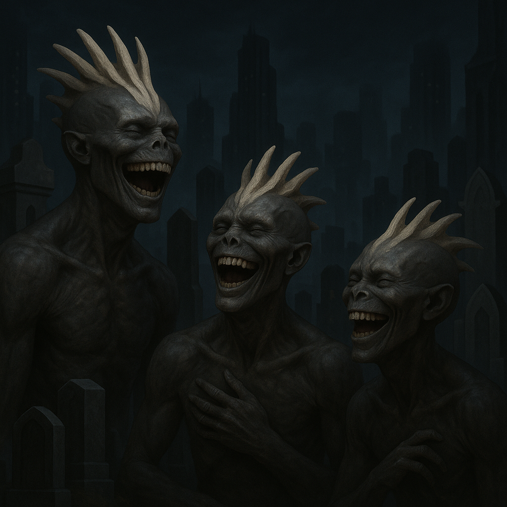

## Skellivon

### Description:

The Skellivon are bone-crested beings sheathed in dark, leathery skin, their heads crowned with elaborate ridges and crests of pale bone that mark lineage, age, and achievement. These crests grow and branch throughout a Skellivon's life, so that an elder's skull becomes a living record of its history, read as easily by its kin as a written chronicle. Beneath those striking crowns their faces are wide and mobile, prone to broad, toothy grins, for the Skellivon are a people who laugh easily and often, even — especially — in the face of death.

Where other species mourn their dead with solemnity and tears, the Skellivon mourn with laughter. Their funerals are raucous, joyous affairs, long nights of feasting and storytelling in which the departed is honored by the telling of its funniest, most embarrassing, most gloriously absurd moments. They believe that a soul lives on only so long as it is remembered, and that nothing fixes a memory more firmly than laughter — a dead Skellivon who can still make the living howl with mirth has, in a very real sense, cheated death itself.

This conviction suffuses the whole of Skellivon culture. They are inveterate storytellers and comedians, prizing wit above wealth and a good jest above a grand monument. Their histories are preserved not as dry chronicles but as sprawling comic epics, each generation embellishing the funny parts, so that their past is at once deeply remembered and gleefully exaggerated. To be forgotten is the only true death a Skellivon fears, and to be remembered with laughter is the highest honor it can hope to earn.

Socially the Skellivon gather into boisterous, close-knit clans centered on their halls of remembrance, where the stories of the dead are kept alive in constant retelling. Status flows to the finest storytellers and the sharpest wits, and even their councils of governance are conducted with a running thread of humor that outsiders often find bewildering. Warm, irreverent, and fiercely devoted to their kin, the Skellivon face hardship and loss with a defiant grin, certain that so long as someone, somewhere, is still laughing at the old stories, no one they loved is ever truly gone.

### Notable Traits:

- Habitat: Rocky uplands and the great halls of remembrance carved into them
- Lifespan: Moderate — around 95 years
- Strength: Prodigious memory, storytelling, and unshakeable morale
- Weakness: Irreverence that offends more solemn neighbors; slow to take threats seriously
- Temperament: Jovial, irreverent, and fiercely loyal

### Fun Fact:

A Skellivon's bone crest records its life's great jokes, and the most honored elders have crests so ornate they must duck through doorways.

---

*"Weep if you must, but tell a joke first; the dead hear laughter longest."* — Skellivon funeral-saying

[Back to Aliens](../aliens.md#skellivon)
