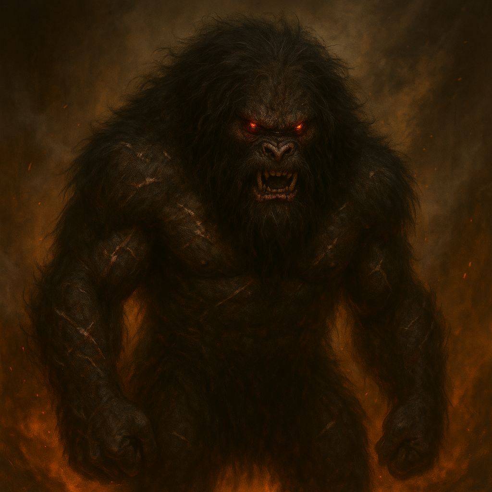

## Skorvang

### Description:

The Skorvang are a nightmare glimpsed through steam and firelight. Hunched and shaggy, their matted black pelts crusted with ash and old blood, they are all shoulders and gnashing jaws, with eyes that glow a sullen ember-red from somewhere beneath a tangle of filthy mane. White scars crisscross their thick hides and knotted scar-tissue has sealed over wounds that would have killed anything else. They do not seem to feel pain, or cold, or fear; they seem instead to feel only a low, constant, grinding fury, as if some furnace at their core has been left burning out of control since the day they were born.

The Skorvang keep to the deep volcanic badlands and want nothing — nothing — from the outside world but its absence. They do not trade. They do not parley. They have, as far as any surviving envoy can report, no interest whatsoever in words, treaties, tribute, or any other transaction that is not conducted with teeth. Theirs is the purest isolationism imaginable, a wall of pure hostility raised against the entire universe. Those few who have crossed into Skorvang territory and lived describe no cities, no leaders, no discernible society at all — only scattered pits and nests, and the ever-present danger of a shape detaching itself from the smoke and coming for you at a dead sprint.

What makes the Skorvang so lethal is that their aggression has no brakes and no reasoning behind it. They do not fight for land or glory or vengeance; they fight because the sight of another living thing seems to light the furnace, and the furnace demands blood. A Skorvang berserker will charge a line of a hundred spears alone and shrieking, will keep fighting with limbs shattered and hide opened, will not stop until it is in pieces or everything in front of it is. They cannot be bargained with, bought off, intimidated, or reasoned into peace, because there is no one home to negotiate with — only the fury, and the long red work it is forever hungry to do.

### Notable Traits:

- Habitat: Smoking volcanic badlands no sane creature enters twice
- Lifespan: 30 years of unbroken rage
- Strength: Insensate, unstoppable berserker fury; fights long past any mortal wound
- Weakness: No strategy, no diplomacy, no self-preservation whatsoever — pure reckless frenzy
- Temperament: Savage, isolationist, and utterly feral — hostility with no off switch

### Fun Fact:

No one has ever recorded a word of the Skorvang language, and scholars increasingly suspect there isn't one.

---

*"We tried to send words. The words did not come back. Neither did the mouths that carried them."* — final entry, Envoy Mission Seven

[Back to Aliens](../aliens.md#skorvang)
