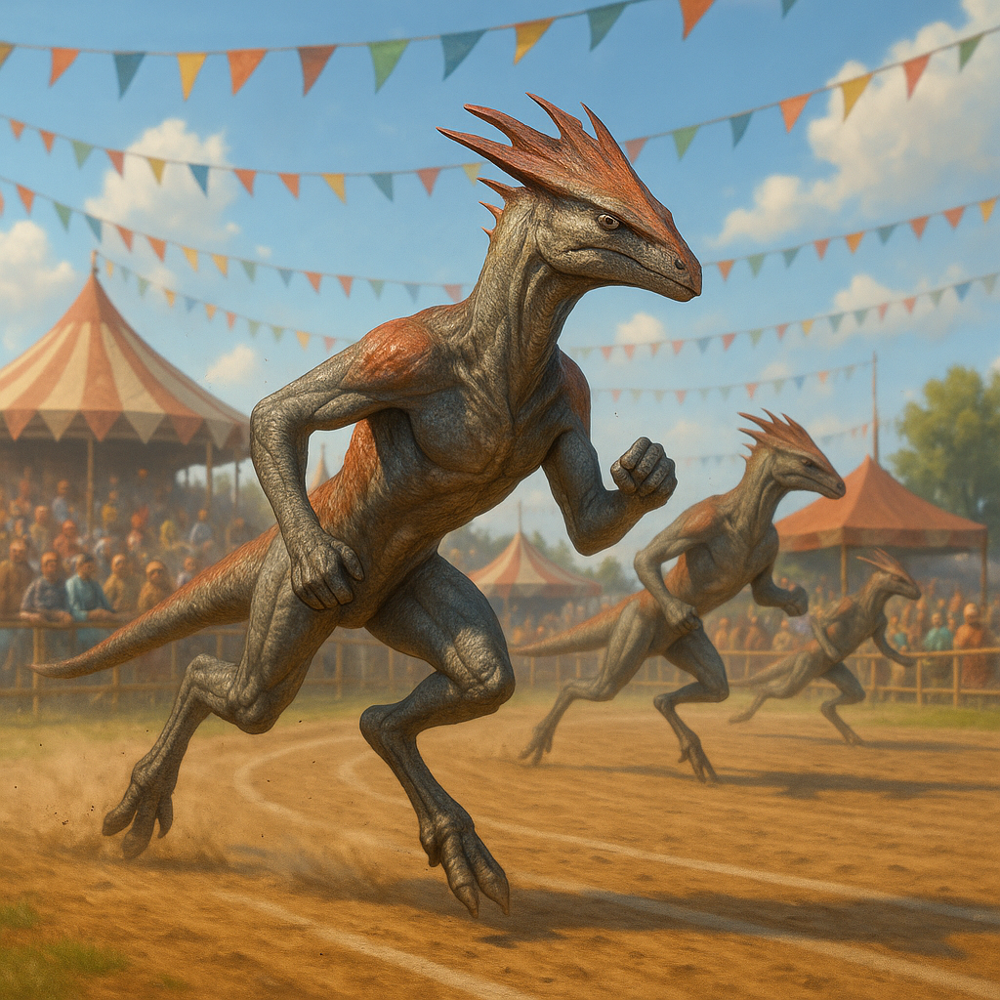

## Struxil

### Description:

The Struxil are lean, fast-moving runners built for the long chase across open plains. Their bodies are all tendon and spring — powerful hind limbs, deep lungs, and lightweight frames — and a vivid, bladelike **crest** rises along the head and spine, flushing with color as the blood pumps during hard exertion. Everything about their physiology speaks of motion: they are restless at rest, and seem truly content only when the ground is unspooling beneath their long, tireless strides.

For the Struxil, running is religion. Their most sacred observances are the great **endurance races**, grueling festivals in which the faithful run for days across the open country, pacing themselves against sun and distance in a shared act of devotion. Crucially, these are not contests of raw speed — the Struxil hold **stamina** to be the true virtue, revering not the swiftest sprinter but the one who endures longest and finishes strong. To them, the frantic burst that fades is a kind of vanity; the steady, unflagging pace is wisdom made flesh.

This philosophy of the long haul runs through their entire culture. The Struxil value persistence, pacing, and the patient conservation of effort in all things, distrusting flash and favoring the slow, sure accumulation of progress. Their leaders are chosen for staying power rather than brilliance, their stories celebrate the one who never quit, and their highest praise — "they finished strong" — is spoken as an epitaph of honor. A Struxil would rather arrive late and whole than first and spent, for in their eyes the race, like life, belongs to those who can simply keep going.

### Notable Traits:

- Habitat: Open plains, savannas, and steppe
- Lifespan: 70–95 years
- Strength: Extraordinary stamina and tireless long-distance running
- Weakness: Restless, fidgety, and poorly suited to confinement or stillness
- Temperament: Energetic, persistent, and competitive

### Fun Fact:

A Struxil endurance festival can last three days, and the runner who crosses the line last but still standing is honored above the one who finished first and collapsed.

---

*"The sprinter wins the hour; the pacer wins the day."* — Struxil proverb

[Back to Aliens](../aliens.md#struxil)
