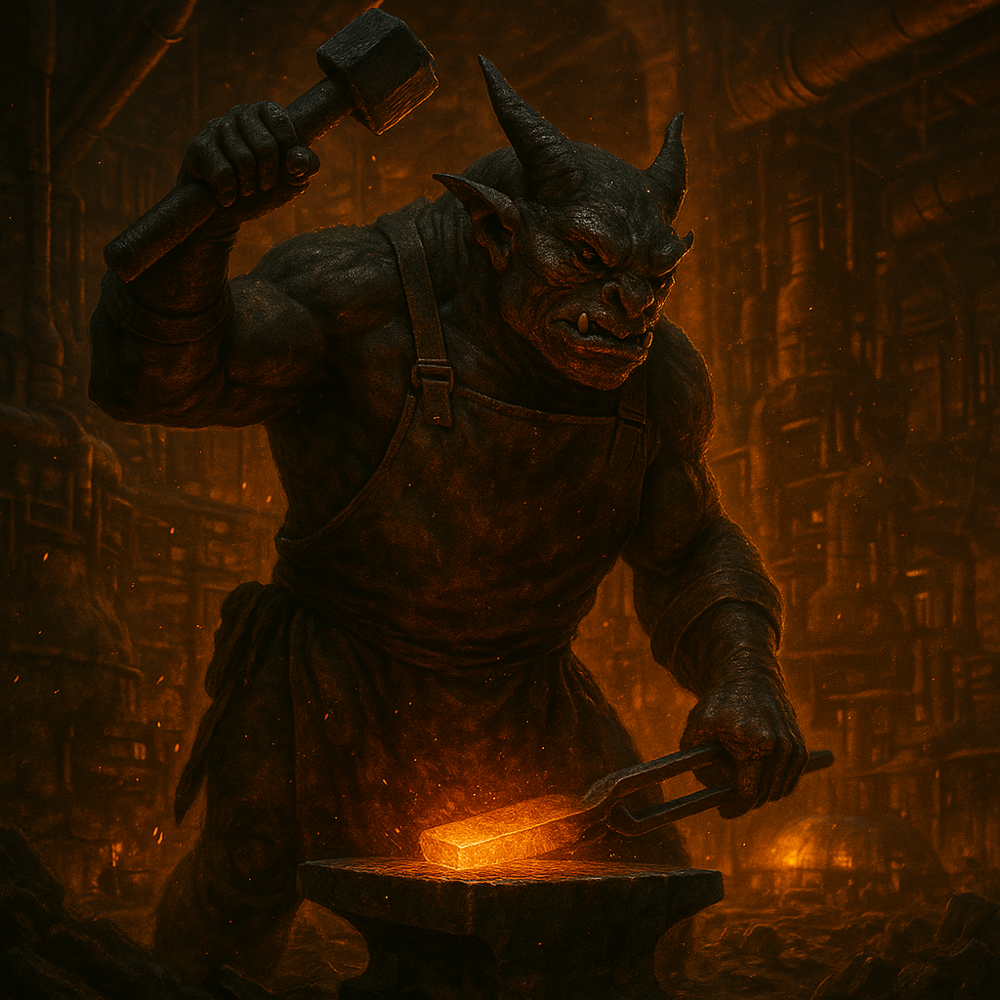

## Sundraxi

### Description:

The Sundraxi are a wiry, soot-dusted people whose skin has the dull sheen of worked metal and whose fingers end in hardened, tool-like tips that can scribe, solder, and shape without instruments. Glowing filaments run beneath their hide like veins of molten ore, brightening when they concentrate, so that a Sundraxi deep in work seems lit from within by the forges they so revere. They are a restless, ever-tinkering people, and a Sundraxi standing idle is a Sundraxi already redesigning the room around them in their mind.

Industry is not merely the Sundraxi economy; it is their cosmology. They believe the universe itself is an unfinished machine, and that the sacred duty of a thinking species is to improve upon it — to smelt, to build, to replace the crude with the refined. Their forge-worlds blaze without pause, their factories layered into vast vertical cities where the hammering never stops and the sky glows orange with industry. A Sundraxi child is given their first tools before they can walk, and status among them is measured entirely in what one has built and how cleverly it outperforms what came before.

What sets the Sundraxi apart from other builder-peoples is their relentless adaptability. They are heretics of their own traditions, forever tearing down last year's masterwork to raise something better, discarding methods the moment a superior one appears. Where other industrial cultures ossify into guilds and dogma, the Sundraxi treat every design — social, mechanical, philosophical — as a prototype begging to be scrapped and reforged. They retool their entire civilization to meet a new challenge the way other species change their minds, and this fusion of furious productivity with fearless reinvention makes them perhaps the most dangerous engineers in the known reaches.

### Notable Traits:

- Habitat: Blazing forge-worlds and vertical factory-cities
- Lifespan: 110 years
- Strength: Unrelenting industrial output paired with endless reinvention
- Weakness: Scrap and rebuild so compulsively they rarely leave anything finished
- Temperament: Driven, inventive, and gleefully iconoclastic

### Fun Fact:

The Sundraxi hold a festival every few years at which they ceremonially destroy their single greatest invention — to prove nothing is too precious to improve upon.

---

*"A finished thing is a dead thing. Hand me the hammer."* — Sundraxi forge-master's refrain

[Back to Aliens](../aliens.md#sundraxi)
