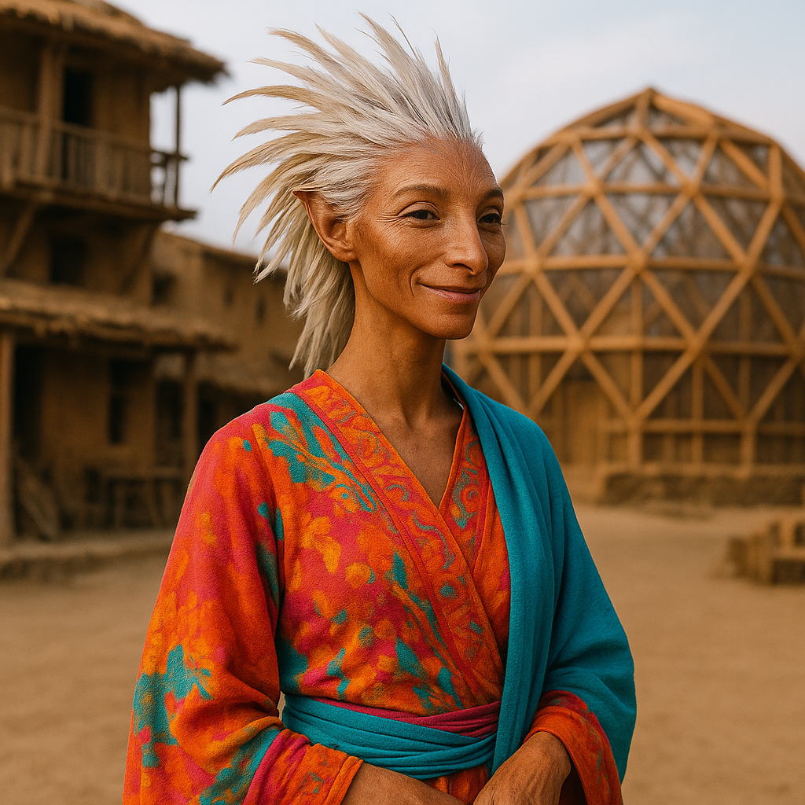

## Sythara

### Description:

The Sythara are a graceful, long-limbed people whose heads and shoulders are crowned not with hair but with cascades of fine, iridescent feathers that ripple and rise with their emotions. Their senses are extraordinarily keen — eyes that catch the smallest motion, ears that register the faintest tremor of sound — giving them an alertness that borders on the preternatural. They move with a poised, deliberate elegance, every gesture seeming rehearsed, for among the Sythara even the smallest motion is a kind of speech.

At the heart of their civilization stand the ritual storytellers, the Weavers of Memory, who hold a position somewhere between priest, historian, and sorcerer. Through intricate songs layered with harmonic overtones that only Sythara ears can fully parse, these Weavers do not merely recount history — they induce it, casting their listeners into shared visions in which an entire audience relives the events being sung. To hear a master Weaver perform is to stand upon ancient battlefields, to feel the grief of long-dead lovers, to witness the founding of the world as though present at it. History, for the Sythara, is not remembered but experienced anew.

This capacity to share visions has made the Sythara a people of profound empathy and startling cohesion, for they quite literally feel one another's pasts. Lies are difficult among them, since any dispute may be settled by a Weaver singing the memories of those involved into a shared vision for all to judge. Their society is organized around the great Song-Halls, and standing is earned by the richness of the memories one contributes to the communal weave. The Sythara believe that when they die, their memories do not vanish but settle into the Great Song, to be sung again by future Weavers, so that no Sythara is ever truly gone so long as their story can still be shared.

### Notable Traits:

- Habitat: Temperate highlands and song-halls
- Lifespan: 140 years
- Strength: Vision-inducing storytelling and acute senses
- Weakness: Overwhelmed by chaotic, dissonant stimuli
- Temperament: Empathetic, artistic, and perceptive

### Fun Fact:

A Sythara trial requires no judge or jury — only a Weaver to sing the memories of the accused into a shared vision, letting the whole community witness the truth firsthand.

---

*"We do not tell the past. We return to it, together."* — Sythara Weaver of Memory

[Back to Aliens](../aliens.md#sythara)
