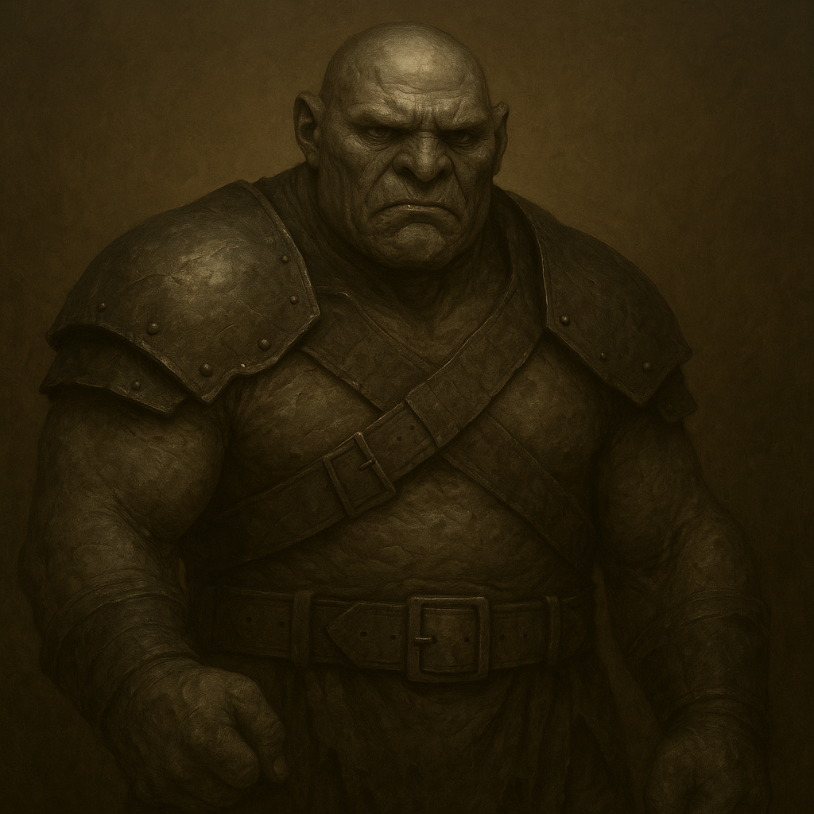

## Tharnok

### Description:

The Tharnok are heavy, grim-faced creatures the color of cold iron, with blunt features set in a permanent scowl and jaws that work slowly when they deign to speak at all. Their skin hangs in thick, scarred folds, and old wounds are left to heal rough and visible, worn as plainly as any badge. They are an unlovely people and know it, caring nothing for ornament or grace, and a Tharnok's gaze lands on everything with the same flat, measuring contempt. When one does speak, the words come out blunt as a dropped stone — no softening, no courtesy, only the thing itself.

Tharnok society is ruled by warlords, stern and humorless, who govern through sheer force of will and the plain fear they inspire. There is little art and less ceremony among them; what passes for culture is a hard code of duty, strength, and grim endurance. A Tharnok warlord does not inspire love and would be baffled by the suggestion that one should — obedience is enough, and obedience is given because the alternative is worse. They are tactless to the point of cruelty in their dealings, incapable of flattery and uninterested in the feelings their words trample, yet they keep their blunt word with the same grim literalism they bring to everything else.

The Tharnok are militant to the bone, forever drilling, campaigning, and expanding their warlords' domains, but their aggression is cold rather than frenzied. They do not charge screaming into ruin; they advance like a slow landslide, grinding down resistance with grim persistence and accepting losses as a cost to be paid, never celebrated. A Tharnok warlord will spend soldiers without flinching but not without reason, for waste offends their stern sense of order as much as weakness does. They make poor neighbors and worse diplomats, giving offense without noticing and demanding respect they will not return — but when a Tharnok says a border will not be crossed, it is a promise written in iron.

### Notable Traits:

- Habitat: Bleak warlord-holds on hard, defensible high ground
- Lifespan: 100 years
- Strength: Grim endurance and relentless, unflinching military pressure
- Weakness: Tactless and friendless; incapable of winning allies or soft power
- Temperament: Militant and stern, aggressive yet cold and deliberate

### Fun Fact:

The Tharnok have no formal word for "please" — requests are phrased as flat statements of fact, and the softest thing a Tharnok can say is simply to leave a threat unspoken.

---

*"I did not ask you to like it. I told you how it will be."* — Tharnok warlord's decree

[Back to Aliens](../aliens.md#tharnok)