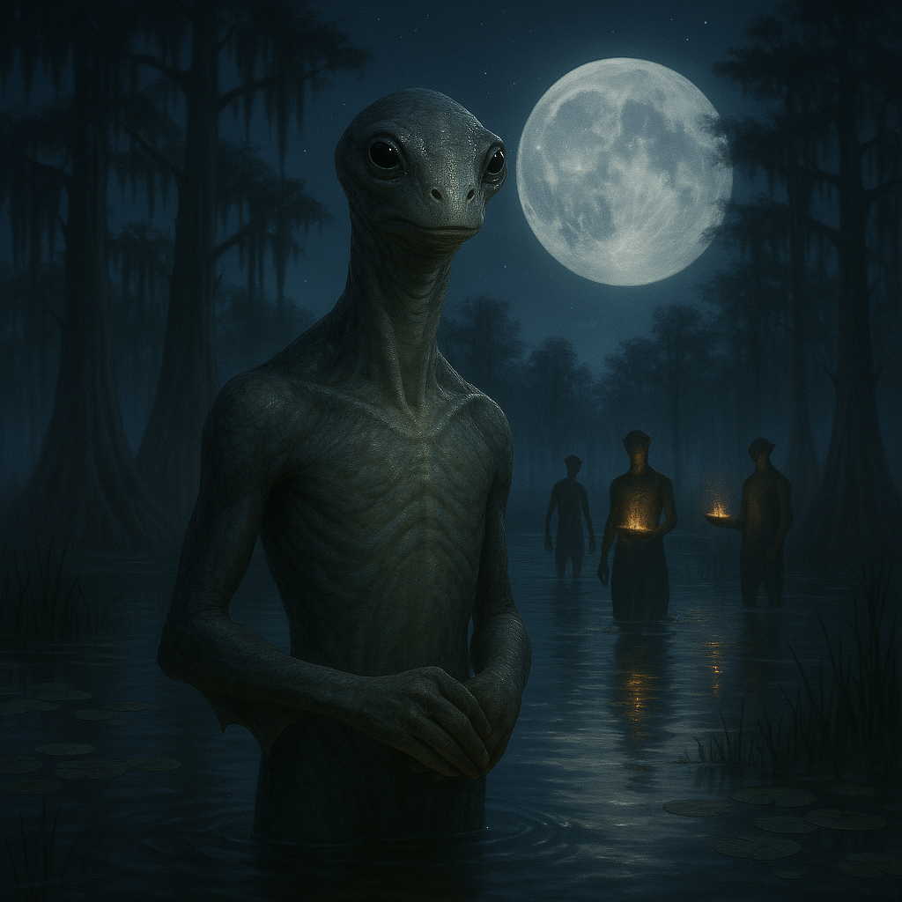

## Thraliun

### Description:

The Thraliun are tall, slender marsh dwellers, their long limbs ending in broad, webbed feet that let them stride across soft mud and float languidly in still water alike. Their skin is cool and faintly mottled in greens and silvers, their eyes large and dark for seeing through murky water and moonlit mist, and their lithe bodies are built for the slow, graceful movement of the wetlands they call home. Equally at ease wading the shallows and gliding beneath the surface, they move through their flooded world with an unhurried, almost ceremonial elegance.

Water and moonlight are sacred to the Thraliun, and the two together form the center of their spiritual life. Their most revered ceremonies are the moonlit water rites, held in still marsh-pools beneath the full moon, where the community gathers to wade into the silvered water and perform slow, synchronized movements that ripple the reflected moonlight into shifting patterns of light. These rites mark the turning of the seasons, the passages of life, and the quiet communion between the Thraliun and the waters that sustain them. The pools are chosen for the perfection of their reflections, and a flawless moon mirrored in still water is, to the Thraliun, a glimpse of the divine.

The Thraliun can remain submerged for hours at a time, and this gift shapes both their practical lives and their inner character. They dive deep into the marsh to gather, to meditate, and to seek solitude in the muffled stillness beneath the surface, and their culture prizes the calm, patient, inward quality that long submersion cultivates. A Thraliun elder may descend into a deep pool and remain there in silent contemplation for half a day, emerging with the serenity of one who has spent long hours alone with their thoughts in the quiet dark. To the Thraliun, the ability to be still and submerged is the ability to be truly at peace.

Thraliun society is tranquil, contemplative, and attuned to the slow rhythms of water and moon. They govern themselves through gentle councils that meet, fittingly, waist-deep in the sacred pools, and they value patience, serenity, and harmony with the wetland world above striving or conquest. Reserved and a touch mysterious to outsiders, the Thraliun are nonetheless warm within their own close communities, bound together by shared waters, shared moonlight, and the quiet certainty that stillness is its own kind of strength.

### Notable Traits:

- Habitat: Marshes, wetlands, and still moonlit pools
- Lifespan: 90 years
- Strength: Able to remain submerged for hours and move gracefully through water and mud
- Weakness: Slow and ill-adapted to dry, arid environments far from water
- Temperament: Tranquil, contemplative, and serene

### Fun Fact:

A Thraliun seeking solitude will submerge in a deep marsh-pool for half a day, emerging only when they have found the inner stillness they sought.

---

*"Be still as the pool at moonrise, and the moon itself will come to rest in you."* — Thraliun proverb

[Back to Aliens](../aliens.md#thraliun)
