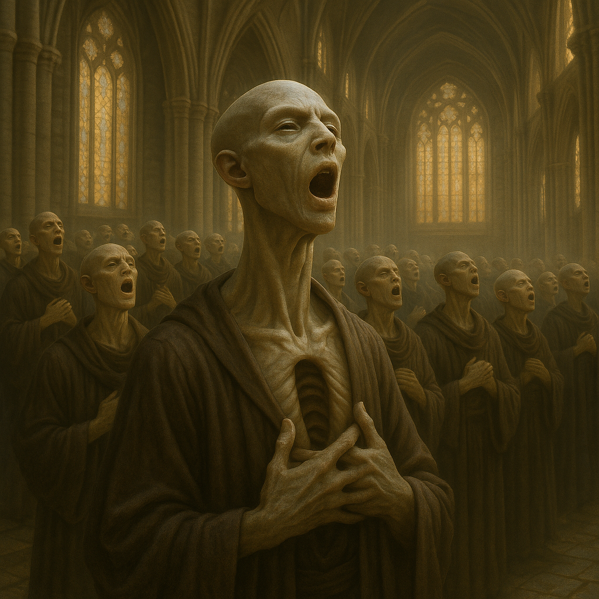

## Threnvox

### Description:

The Threnvox are lean, towering beings built around a single remarkable feature: a vast resonant chest cavity that functions as a living instrument. Beneath taut, drum-tight skin, their ribcages flare into hollow chambers lined with vibrating membranes, so that every Threnvox carries a cathedral organ within its own body. Their limbs are long and spare, their faces narrow and expressive, but it is the chest that dominates — rising and falling, humming faintly even in sleep.

Threnvox language is sung as much as spoken. Ordinary conversation layers meaning in overlapping tones, and a skilled speaker can convey several thoughts at once through chords that would take other species whole sentences to express. Powerful fundamental tones can carry for miles across valleys, and the deepest voices are felt in the bones before they are heard. To be rendered voiceless — by injury or illness — is the gravest fate a Threnvox can imagine, a kind of social death.

Worship among the Threnvox is wholly communal and wholly vocal. Their temples are acoustic marvels, painstakingly carved and tuned to amplify and sustain sound, and the Threnvox are consummate stone-carvers and instrument-builders, forever chiseling resonant chambers, sounding-pillars, and great tuned organs from the living rock. and the central act of faith is the Great Chant — a gathering in which an entire community interlocks its voices into a single, towering harmony that can last from dusk until dawn. They believe the universe itself was sung into being and will one day fall silent, and that each chant briefly rejoins the people to that original creating tone. A Threnvox finds its truest identity not alone but as one voice braided into many.

Their society is organized by vocal register and role within the chant — the deep Drone-keepers who hold the foundation, the Melodists who weave the moving lines, and the rare Harmonics who can split their voices into chords alone. Status flows from the beauty and reliability of one's contribution to the whole. Disputes are resolved not by debate but by "singing it out," two parties improvising against one another until the community judges whose line resolves more gracefully. Proud and intensely communal, the Threnvox regard solitude as a sorrow and silence as the only true enemy.

### Notable Traits:

- Habitat: Resonant canyons, cave-cities, and acoustically rich highlands
- Lifespan: Moderate — around 90 years
- Strength: Overwhelming vocal power and the coordination of mass chant; skilled resonant stone-carvers and instrument-builders
- Weakness: Dependent on community; isolated individuals weaken and despair
- Temperament: Proud, communal, and passionately expressive

### Fun Fact:

The lowest note a Threnvox elder can produce is said to loosen stones from a cliff face half a league away.

---

*"A single voice is a question; the chant is the answer."* — Threnvox temple proverb

[Back to Aliens](../aliens.md#threnvox)
