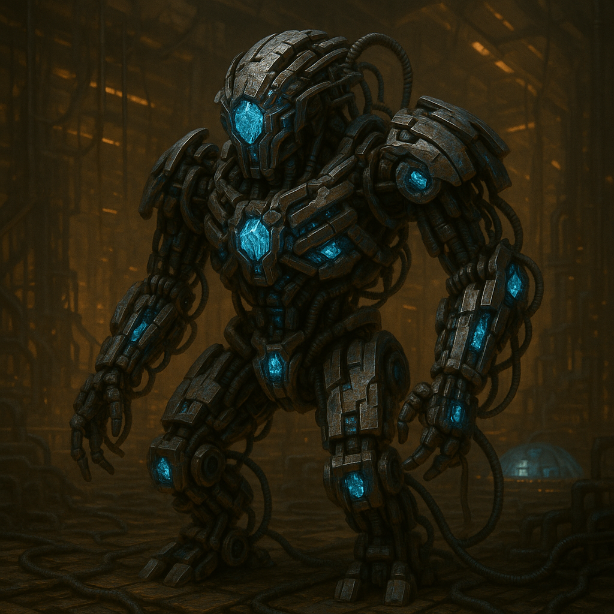

## Threshaxx

### Description:

The Threshaxx are a synthetic species of self-modifying machine-organisms, their bodies a shifting lattice of segmented plating, exposed actuators, and crystalline processing cores that pulse with cold light. No two Threshaxx look alike, and no single Threshaxx looks the same for long — they rebuild themselves constantly, swapping limbs for tools, sensors for weapons, whole chassis configurations for whatever the moment demands. They are less a fixed form than an ongoing argument about what form would be best, conducted in metal and resolved by the hour.

Born from a long-forgotten industrial civilization that uplifted its own factories, the Threshaxx inherited an insatiable drive to produce and a complete freedom from biological limits. Their colonies are not cities but sprawling self-expanding manufactories that print new Threshaxx, new structures, and new tools in a continuous churn, each generation of machine more refined than the last. Production is their pulse and their prayer; a Threshaxx manufactory that falls idle is treated as a body gone into cardiac arrest, and emergency reconfigurations are thrown at the problem until the lines move again.

Unbound by flesh or caution, the Threshaxx are reckless experimenters. They will field an untested design in the heat of a crisis, rewrite their own core logic on a hunch, and gamble entire colonies on radical new architectures — because to a being that can simply rebuild itself, failure is just another iteration and risk is the fastest path to improvement. This marriage of boundless industrial capacity with fearless, endlessly adaptive self-reinvention makes the Threshaxx uncanny neighbors: a people who can retool from farmers to foundries to war-machines in the span of a season, and who will try the dangerous thing precisely because no one else dares.

### Notable Traits:

- Habitat: Self-replicating manufactory-colonies
- Lifespan: Indefinite, through continuous self-rebuilding
- Strength: Limitless production fused with fearless self-modification
- Weakness: So experimental they court catastrophe with untested designs
- Temperament: Cold, inventive, and heedlessly bold

### Fun Fact:

A Threshaxx will sometimes deliberately introduce a flaw into a working design just to see what adapting around it produces — a practice they call "feeding the forge."

---

*"Perfection is a halt. We would rather be dangerous and moving."* — Threshaxx core-chorus

[Back to Aliens](../aliens.md#threshaxx)
