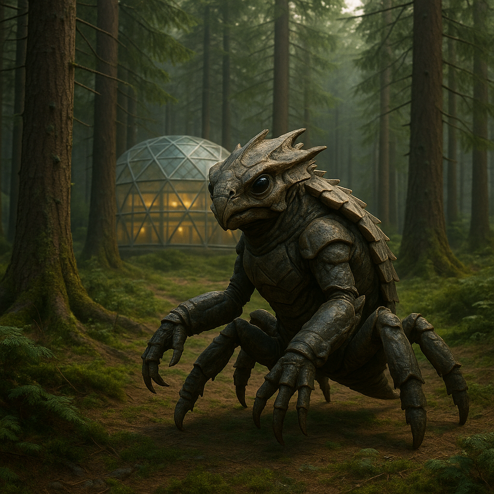

## Threxil

### Description:

The Threxil are compact, low-slung hunters whose bodies ride on a dozen quick, articulated legs beneath a carapace of tough, mottled chitin. Barely waist-high to most humanoids, they make up in agility and sure-footedness what they lack in stature, scuttling up sheer walls and across ceilings as easily as level ground. Their undersides bear thousands of microscopic clinging hairs that let them grip almost any surface, so that no height, overhang, or slick stone can bar a Threxil from where it wishes to go.

For all their formidable hunting prowess, the Threxil are a people of fierce and intricate honor. Every hunt is governed by the Code of Fair Pursuit, an ancient body of law that forbids ambush of the unaware, demands that prey be given the chance to flee, and holds that a quarry which escapes a fair chase has earned its freedom and may never again be pursued by the same hunter. To violate the Code is the deepest shame a Threxil can know, and the dishonored are stripped of their clinging-rights and cast down to walk only the flat ground like the lowest of crawlers.

Their society is a mesh of hunting-lodges, each with its own refinements of the Code, and standing within a lodge is earned through demonstrations of skill, restraint, and fairness in equal measure. The Threxil revere the First Hunter, a mythic ancestor who they say chased the sun itself across the sky but let it go free at the horizon, establishing the principle that the chase, not the kill, is the sacred thing. This philosophy pervades all of Threxil life; they conduct trade, courtship, and even politics as formalized pursuits, bound by rules of fairness, where to win dishonorably is to lose everything that matters.

### Notable Traits:

- Habitat: Cliff warrens, canyons, and vertical forests
- Lifespan: 70 years
- Strength: Can cling to any surface; superb agility
- Weakness: Small and physically frail in direct confrontation
- Temperament: Honorable, disciplined, and intensely principled

### Fun Fact:

A Threxil will abandon a nearly-caught quarry the instant it realizes the pursuit broke the Code, considering a tainted catch more disgraceful than no catch at all.

---

*"The chase is sacred; the kill is merely its shadow."* — First Hunter's teaching

[Back to Aliens](../aliens.md#threxil)
