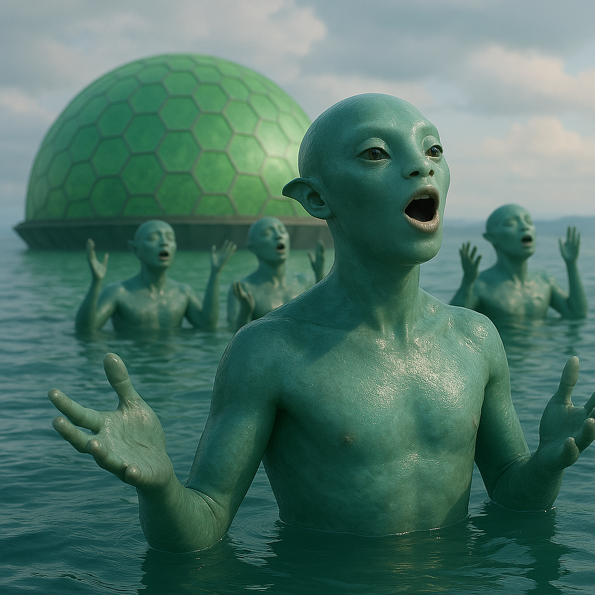

## Trelisso

### Description:

The Trelisso are an amphibious, smooth-scaled people whose supple bodies gleam like wet river-stones, equally at home in the water and on the banks beside it. Their scales shimmer in soft blues and greens, their throats swell with powerful resonating sacs, and their large, lidded eyes are set for seeing both above and below the surface. They dwell along the rivers, lakes, and flooded lowlands of their world in sprawling, sociable communities, forever slipping between the two worlds of air and water that define their lives.

Song is the soul of the Trelisso. Their resonating throats produce tones of remarkable richness and carrying power, and crucially, their songs travel through water as readily as through air — a Trelisso singing beneath the surface can be heard clear across a lake by every kin submerged within it. This gift has made communal singing the central act of their culture, the medium through which they celebrate, mourn, court, worship, and simply pass the time. A Trelisso settlement is never silent for long; its waters hum day and night with overlapping choruses rising and falling like the current itself.

Every milestone of Trelisso life is marked by song. Births are welcomed with bright, cascading melodies; unions are sealed with duets that intertwine two voices into one; and the dead are mourned with vast underwater dirges in which an entire community submerges together and sings as one, the water itself seeming to grieve. To sing alone is to be lonely; to sing in chorus is to be truly alive. A Trelisso measures the health of a community by the beauty and fullness of its collective voice, and a settlement whose songs have grown thin and quiet is understood to be a settlement in trouble.

Theirs is a warm, gregarious, deeply interdependent society that abhors solitude and prizes harmony in both the musical and social sense. Status flows to the finest voices and the most gifted composers, and disputes are often resolved not by argument but by song-contest, in which the more beautiful and moving performance carries the day. Open-hearted and expressive, the Trelisso find the quiet, reserved manners of other species faintly sad, as though those peoples had simply forgotten how to sing.

### Notable Traits:

- Habitat: Rivers, lakes, and flooded lowland communities
- Lifespan: 75 years
- Strength: Powerful voices that carry through water and seamless amphibious living
- Weakness: Dependent on close community and prone to despondency in isolation
- Temperament: Gregarious, expressive, and harmonious

### Fun Fact:

A Trelisso funeral is held entirely underwater, where the whole community submerges and sings a dirge so resonant that the surface of the water trembles with it.

---

*"A single voice is only a note; it is the chorus that makes the song."* — Trelisso proverb

[Back to Aliens](../aliens.md#trelisso)
