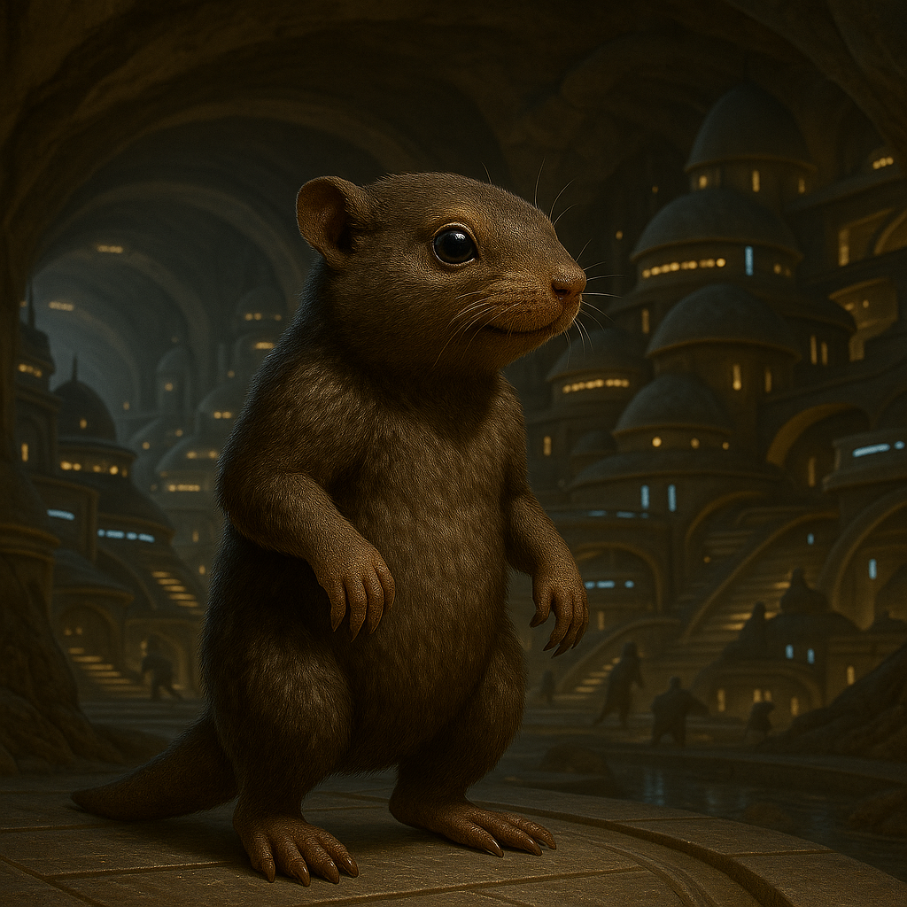

## Trennoss

### Description:

The Trennoss are small, burrowing gatherers, compact and powerfully built for a life spent tunneling through the rich earth. Their bodies taper into blunt, muscular hindquarters driven by tremendous hind legs, equally suited to digging and to the explosive leaps that carry them clear of danger. Short, dense fur the color of soil cloaks them, their forelimbs end in broad digging claws, and their faces are set with small, dark eyes and wide, sensitive ears attuned to the faintest vibration in the ground.

Trennoss life is lived below the surface, in sprawling warren-villages of interlocking tunnels, chambers, and larders dug deep into the hillsides and meadows — vast feats of excavation and underground engineering, their tunnel-granaries buttressed, vented, and drained with a craft that keeps the harvest sound through any season. Chief among these chambers are the great communal food stores, where the entire village pools the harvest of its endless gathering against the lean seasons. No Trennoss hoards privately; the store belongs to all, and the gravest crime in their society is the theft or hoarding of shared food. Their whole culture is a monument to collective thrift and the quiet security of a well-stocked larder.

Deprived of light in their deep tunnels, the Trennoss communicate through rhythmic thumping — drumming their powerful hind legs against the earth in intricate patterns that carry through the soil for great distances. This thump-language can convey warnings, news, invitations, and even elaborate stories, and skilled "drummers" are honored as both messengers and poets. The rhythm of the warren is constant, a soft percussive heartbeat that tells every member where its neighbors are, what they are doing, and whether all is well.

Socially the Trennoss are deeply egalitarian and cooperative, organized into warrens governed by councils of elder gatherers whose authority rests on their knowledge of the tunnels and the seasons. Decisions are drummed out and answered communally, dissent expressed in counter-rhythms until a consensus beat emerges. Industrious, cautious, and warmly social, the Trennoss fear open spaces and bright skies but find profound comfort in the close, dark, companionable warmth of the warren, where the thump of a thousand feet assures each of them that it is never truly alone.

### Notable Traits:

- Habitat: Underground warrens beneath meadows and rolling hills
- Lifespan: Short — around 20 years
- Strength: Prodigious, tireless excavation of engineered tunnel-granaries and burrow-works; powerful leaps, and communication through earth-borne rhythm
- Weakness: Poor eyesight and deep unease in open, exposed terrain
- Temperament: Industrious, cooperative, and cautious

### Fun Fact:

A Trennoss can recite an entire family history by thumping, with no two drummers' renditions ever quite alike.

---

*"A full store and a steady beat; what more does a warren need?"* — Trennoss gatherer's rhyme

[Back to Aliens](../aliens.md#trennoss)
