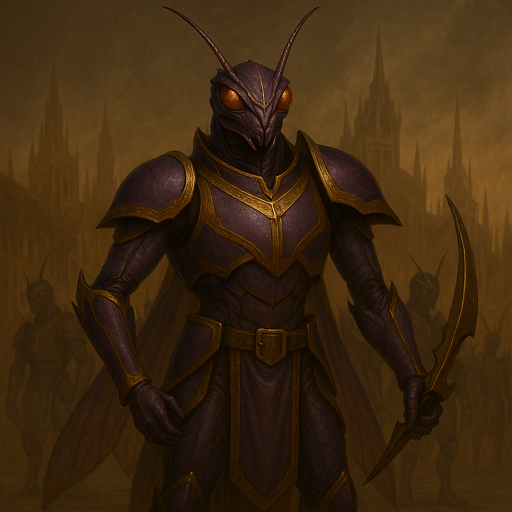

## Tyrraxis

### Description:

The Tyrraxis are elegant in the way a blade is elegant — long, lean, and purposeful, their chitinous exoskeletons lacquered in the deep imperial violets and golds of their caste. Four arms fold with mechanical precision, two for labor and two tipped in retractable scything claws, and their segmented eyes drink in the full sweep of a battlefield at once. They carry themselves with the cold composure of a people who have never doubted their destiny, and when a Tyrraxis legion advances it does so in silent, interlocking ranks, each unit flowing into the next like the moving parts of a single vast and patient engine.

The Tyrraxis are empire-builders above all else, and their empire is not a place but a direction. Their entire civilization is organized around the doctrine they call the *Unending Advance*: the conviction that a culture which is not conquering is dying, and that peace is merely the pause in which rot sets in. They are extraordinarily adaptable, absorbing the technologies, tactics, and even the useful customs of every people they overrun, so that each conquest leaves them stronger and better-equipped for the next. Defeated foes are not exterminated but assimilated into the lowest castes, their descendants raised to believe in the Advance as devoutly as any Tyrraxis — for the empire grows not only by taking land but by taking minds.

Their aggression is therefore neither rage nor appetite but ideology, cold and total. A Tyrraxis does not hate its enemies; it simply cannot conceive of leaving them unconquered, any more than a river can conceive of flowing uphill. They plan campaigns in centuries, map borders they intend their great-grandchildren to erase, and treat the entire continent as a problem of logistics to be solved one annexation at a time. This makes them perhaps the most dangerous of all the warlike peoples, for the Tyrraxis will never tire, never be sated, and never stop — not because they are furious, but because stopping has quite literally never occurred to them.

### Notable Traits:

- Habitat: Terraced hive-citadels at the heart of an ever-expanding frontier
- Lifespan: 70 years, but the empire is counted in dynasties
- Strength: Doctrinal, adaptable, tireless expansion that absorbs every foe's strengths
- Weakness: Rigid devotion to the Advance; cannot recognize when a war is not worth winning
- Temperament: Coldly, ideologically aggressive — conquest is not a choice but a law of nature

### Fun Fact:

Tyrraxis maps are drawn with the empire's borders in a dotted line labeled "provisional," because to a Tyrraxis every frontier is temporary by definition.

---

*"The map is never finished. It is only as far as we have gotten."* — Tyrraxis doctrine of the Unending Advance

[Back to Aliens](../aliens.md#tyrraxis)
