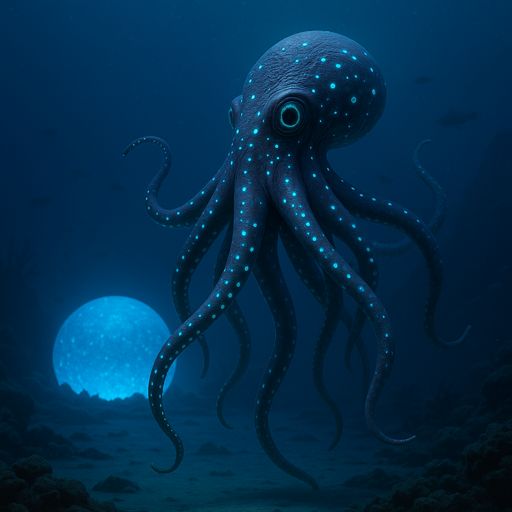

## Ubelquor

### Description:

The Ubelquor are tentacled, deep-water intelligences whose smooth, dark bodies trail long clusters of sinuous arms, each tip crowned with faintly glowing **luminous markings** that drift and shimmer in the crushing black of the abyss. Large, soulful eyes gaze out from bulbous heads, and their skin flushes with slow waves of color as thoughts move through them. Dwelling in the lightless deep where sound travels strangely and sight fails, they have evolved a very different way of knowing one another.

The Ubelquor **share knowledge through touch**. When two of them intertwine their tentacles, they exchange not merely sensation but memory itself — images, understandings, whole experiences flowing between them in a silent communion of entwined limbs. To an Ubelquor, learning is literally to be touched by what another has lived, and their vast repositories of lore are preserved not in books but in long chains of touch-memory passed hand to hand down the generations. Their greatest scholars are those who have been touched by the most, carrying within them the layered memories of countless ancestors.

From this flows their most sacred belief: that **memory is a communal treasure**, belonging not to any one individual but to the whole people. To hoard a memory is unthinkable; to share it is a solemn duty, for an experience untransmitted is, to them, an experience lost forever. The Ubelquor gather in great silent conclaves of interlaced limbs to pool and preserve what they have learned, and they regard the forgetting of their people's memory as the only true death. Patient, deep-feeling, and profoundly interconnected, they move through the dark as a civilization whose mind is, quite literally, held in common.

### Notable Traits:

- Habitat: Deep oceans and abyssal trenches
- Lifespan: 150–190 years
- Strength: Touch-based memory sharing and vast collective knowledge
- Weakness: Bound to deep water; helpless in open air or shallows
- Temperament: Thoughtful, communal, and reverent

### Fun Fact:

An Ubelquor can inherit the vivid first-hand memories of an ancestor dead for centuries, passed down through an unbroken chain of touch.

---

*"A memory kept to oneself is a memory already dying."* — Ubelquor proverb

[Back to Aliens](../aliens.md#ubelquor)
