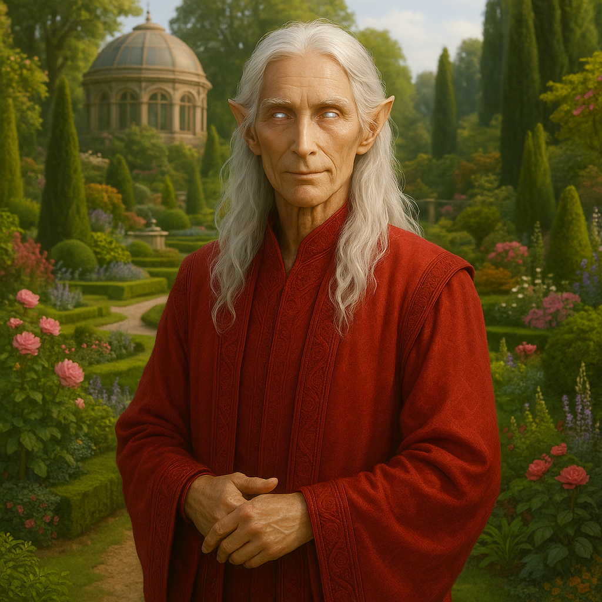

## Ulvarion

### Description:

The Ulvarion are a tall, slender, long-lived people, their flowing silver hair cascading like liquid starlight and their eyes glowing with a soft inner luminescence that brightens when they are moved and dims when they rest. They move with an unhurried grace befitting beings who count their years in centuries, and their faces, though ageless in appearance, carry a depth of calm that only vast experience can bestow. To speak with an Ulvarion is to feel the weight of accumulated memory behind every measured word.

Time, for the Ulvarion, is a thing to be cultivated — quite literally. Rather than carve monuments or write chronicles, they mark the passage of the ages through elaborate living gardens, vast and intricate landscapes planted and tended across generations, where every grove, pool, and winding path commemorates an era, an event, or a cherished memory. An Ulvarion garden is a history book grown from soil; to walk its paths is to walk through centuries, and the oldest gardens are living archives tended continuously for a thousand years, each new caretaker adding a planting to mark the deeds of their own age.

The Ulvarion possess an exceptional clarity of memory, able to recall the fine detail of events decades or centuries past as though they happened that morning. This gift makes them extraordinary scholars, witnesses, and keepers of lore — an Ulvarion elder is a living library, consulted by younger species who have long since lost the records of their own forgotten pasts. Yet it is also a quiet burden, for the Ulvarion forget nothing, neither joy nor sorrow nor slight, and so they have cultivated an elaborate philosophy of forgiveness and perspective to keep the sheer weight of remembrance from crushing them.

Their society is patient, contemplative, and reverent toward continuity. Decisions are weighed against the memory of what has come before and the knowledge that the deciders will live to see the consequences unfold. Change comes slowly to the Ulvarion, who have seen too many hasty revolutions wither, and they regard the brief, frantic lives of shorter-lived species with a mixture of tenderness and gentle melancholy. Serene keepers of the long view, they believe that nothing truly worthwhile can be grown in a single lifetime.

### Notable Traits:

- Habitat: Temperate valleys cultivated into vast ancestral gardens
- Lifespan: 600 years
- Strength: Exceptional long-term memory and the wisdom of great longevity
- Weakness: Painfully slow to change and burdened by the inability to forget
- Temperament: Serene, scholarly, and reverent toward continuity

### Fun Fact:

The oldest Ulvarion garden has been tended without interruption for over a thousand years, and a single ancient tree within it is said to mark the founding of their first city.

---

*"Plant for the garden your grandchildren's grandchildren will one day walk."* — Ulvarion proverb

[Back to Aliens](../aliens.md#ulvarion)
