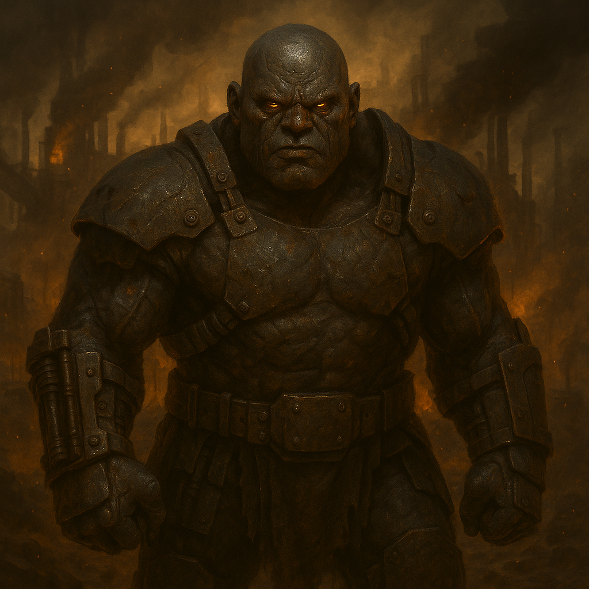

## Ur'Zhul

### Description:

The Ur'Zhul are forge-born and forge-shaped, their dusky iron-grey hides seared and seamed by lifetimes spent at the smelter's mouth. Thick-browed and broad-handed, they wear their soot like a second skin, and many graft worked metal directly into their flesh — plated knuckles, reinforced jaws, pistoning braces along a labor-worn spine. Their deep-set eyes reflect furnace-light with an orange gleam, and when an Ur'Zhul host marches it comes wreathed in the smoke of its own war-engines, the ground trembling under treads and the air ringing with the hammer-chant that paces their advance.

Ur'Zhul society is one vast workshop with a single product: war. Every clan is a guild, every guild a link in a chain of furnaces, forges, and foundries that never cool, turning the ore of conquered lands into the engines that conquer the next. They are a cohesive and intensely cooperative people — the forge admits no loners, and an Ur'Zhul measures their worth by what they contribute to the collective labor — but that cohesion is bent entirely toward making better weapons and crewing them in better order. Where other raiders bring numbers and fury, the Ur'Zhul bring artillery, siege-rams, and armored machines, each stamped with the maker's sigil, each a point of fierce pride for the clan that built it. To the Ur'Zhul, a beautifully made weapon used to shatter a city wall is the highest expression of their craft.

Their warlike nature flows directly from their industry: an engine of war, once built, demands to be used, and a people organized wholly around building such engines will always, inevitably, find somewhere to point them. The Ur'Zhul conquer not out of rage but out of a kind of monstrous productivity — they need ore, they need fuel, they need the proving-grounds of real battle to test the next generation of machines, and every neighbor is simply a supply of all three. They are patient enough to lay a siege for years and ruthless enough to grind a holdout to powder, and they regard the ruin they leave behind with the quiet satisfaction of workers surveying a job well done.

### Notable Traits:

- Habitat: Smoke-wreathed forge-cities built atop the richest ore seams
- Lifespan: 80 years, many ending at the furnace they were born beside
- Strength: Industrial war-making — artillery, siege-engines, and armor no raider can match
- Weakness: Tethered to their forges and supply chains; cut the ore and the war machine starves
- Temperament: Aggressive and tireless, channeling fury into the relentless manufacture of war

### Fun Fact:

Every Ur'Zhul war-engine bears the stamped sigil of the clan that forged it, and a machine captured intact is considered a far graver insult than one merely destroyed.

---

*"We do not sharpen the blade for peace. A blade that is never swung is only a bar of wasted iron."* — Ur'Zhul forge-master's creed

[Back to Aliens](../aliens.md#urzhul)
