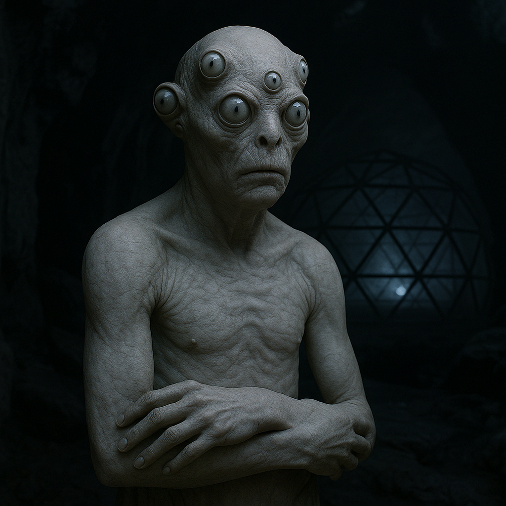

## Uxberos

### Description:

The Uxberos are a pale, cave-dwelling people whose skin has the translucent, waxy sheen of creatures that have never known sunlight. Rings of small, milky eyes encircle their broad heads, nearly vestigial and all but blind, for the Uxberos do not see their world so much as hear it. They perceive through echolocation, emitting rapid trains of clicks and low pulses and reading the returning echoes into a rich, three-dimensional map of the dark around them. In the lightless warrens of their homeworld, this sense is sharper than any sight, letting them "see" through fog, around corners, and even into the hollow spaces within solid rock — and more than most cave-dwellers they put it to work, hewing and fortifying their cave-halls into true dwellings rather than mere shelters.

Their homeworld's vast cave systems are forever shifting — settling, collapsing, and reforming — and so the echoes that define the Uxberos world are never twice the same. This impermanence lies at the root of their entire culture. The Uxberos gather in great councils, the Resonances, where elders called Echo-Readers listen to the changing acoustics of their homeworld and debate their meaning. A shift in the echo of a sacred cavern may be read as omen, instruction, or warning, and the interpretation of these changing echoes governs everything from when to migrate to whom to trust.

Their faith holds that the world is constantly speaking through its echoes, and that wisdom lies not in fixed truths but in listening ever more carefully to a reality that will not sit still. The Uxberos distrust certainty and prize the skilled interpreter who can hold many readings at once; their councils rarely vote and instead seek the Deep Consensus, a slow convergence of listeners toward a shared understanding of what the caves are saying. Patient, consultative, and comfortable with ambiguity, the Uxberos have built a civilization not upon conquering their shifting dark but upon the humble, ceaseless art of listening to it.

### Notable Traits:

- Habitat: Deep cave systems and lightless warrens
- Lifespan: 115 years
- Strength: Precise echolocation; "sees" through dark and stone, and hews and fortifies its cave-halls more than most
- Weakness: Nearly blind to light; dazzled and helpless in open daylight
- Temperament: Contemplative, consultative, and cautious

### Fun Fact:

An Uxberos can tell you the shape, size, and even the recent history of a cavern it has never entered, simply by the way a single clap echoes back from its mouth.

---

*"The caves never say the same thing twice; neither should the wise."* — Uxberos Echo-Reader

[Back to Aliens](../aliens.md#uxberos)
