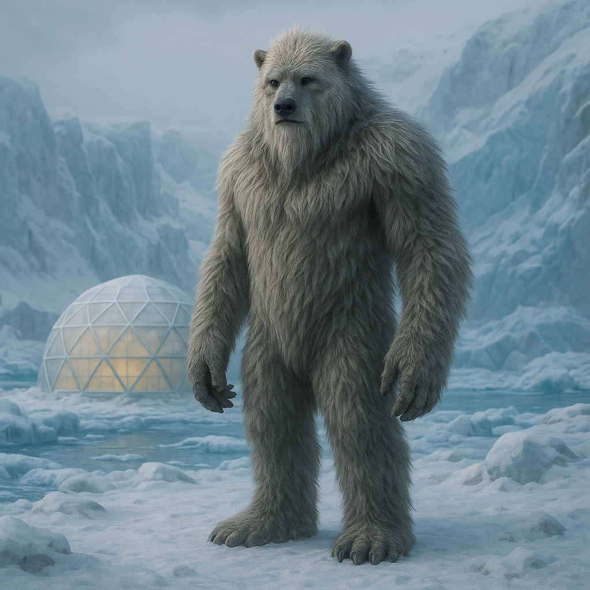

## Vandros

### Description:

The Vandros are towering, broad-shouldered beings cloaked in dense, frost-white fur that thickens into a great mane across their shoulders and backs. Standing head and shoulders above most other peoples, they are built for the killing cold of their glacial homeworlds, with wide feet that spread across snow, nostrils that warm the frozen air before it reaches their lungs, and a layer of insulating blubber beneath the fur. Where others shiver and die, the Vandros grow sluggish and comfortable, and they regard the warm climates of other species as oppressive, suffocating places.

Vandros society revolves around the hearth and the hearth-keeper. Each extended family maintains a great communal fire-hall carved into the ice — and the Vandros dig, carve, and shape these halls far beyond what mere shelter demands, hollowing out vaulted chambers, forging simple tools and hearth-fittings, and ornamenting the walls with worked relief. The hearth-keeper — usually an elder of exceptional memory — is its most honored member. For the Vandros keep no written records; their entire history, law, and lineage survive only in the oral sagas recited around the hearth-fire through the long polar nights. A hearth-keeper may hold ten thousand verses in memory, and the death of one without a trained successor is a catastrophe mourned as the loss of a library.

Their faith is woven from these sagas, a vast tapestry of ancestral heroes whose deeds blur into legend and whose spirits are believed to linger in the ice itself. To the Vandros, to be remembered is to live on, and to be forgotten is the only true death; thus the recitation of names and deeds is their most sacred act. Hospitality around the hearth is a solemn duty, for a guest at the fire becomes, for the night, a part of the saga, and may be woven into the family's remembered history forever. Their low, resonant voices and endless, patient winters have made them a people of deep memory, slow speech, and immense endurance.

### Notable Traits:

- Habitat: Glaciers, tundra, and ice-caverns
- Lifespan: 160 years
- Strength: Thrive in extreme cold; prodigious memory
- Weakness: Suffer and weaken in heat
- Temperament: Patient, solemn, and fiercely loyal

### Fun Fact:

When a beloved Vandros dies, the hearth-keeper adds their deeds to the family saga that very night, so the departed is "speaking" again before the fire grows cold.

---

*"The ice forgets nothing, and neither shall we."* — Vandros hearth-keeper's vow

[Back to Aliens](../aliens.md#vandros)
