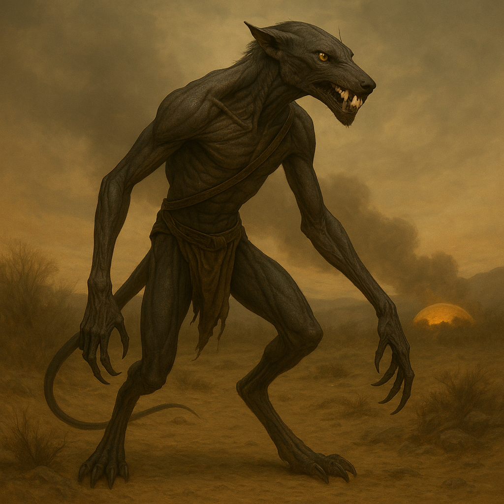

## Vaskarn

### Description:

The Vaskarn are built like something that was designed by hunger and nothing else. Long-limbed and whip-thin, their taut hides stretched over knotted sinew, they lope on digitigrade legs that eat distance with terrifying ease. Their faces narrow to a mouthful of backward-hooked fangs, and their eyes — flat amber, pupil-slit, forever scanning the horizon — carry the perpetual restlessness of a creature that cannot bear to stand still. A Vaskarn at rest looks wrong, like a drawn bowstring; it is only in motion, running down prey across open country, that they seem finally at ease.

The Vaskarn keep no cities and raise no walls. They are reavers of the open road, roaming in lean packs that follow no map but their own appetite, striking far beyond where any enemy expects them and vanishing before a response can gather. They despise the settled peoples with a blunt, uncomplicated contempt — to put down roots, to hoard, to defend a fixed point, is in Vaskarn eyes a failure of nerve. They take what they need and burn what they cannot carry, not out of spite but because weight is the enemy of speed, and speed is the only thing a Vaskarn truly worships. Their packs splinter and reform like weather, bound by nothing but the shared thrill of the next raid.

What makes them so dangerous is their absolute fearlessness, which shades into recklessness so complete it unnerves even other warlike peoples. A Vaskarn does not calculate odds; it does not plan a retreat; it does not, in any meaningful sense, expect to grow old. They ride and strike and die young and loud, and they would not have it any other way. To a Vaskarn, a long cautious life is a kind of slow suffocation, and the only question worth asking of any horizon is what lies beyond it that might be killed, taken, or burned. They roam because stillness is death, and they fight because the chase has to end somewhere.

### Notable Traits:

- Habitat: Nowhere and everywhere — the open plains, the long road, the next horizon
- Lifespan: 40 years, rarely reached
- Strength: Blistering speed and range; strike from impossible distances with no warning
- Weakness: Reckless and undisciplined; no walls, no reserves, no second thoughts
- Temperament: Blunt, fearless, and savagely impulsive — violence first, always

### Fun Fact:

Vaskarn packs have no permanent leaders; command belongs to whoever is riding fastest at the front, and it changes hands a dozen times in a single raid.

---

*"A wall is just a thing that hasn't been climbed yet. Why would we sit behind one?"* — Vaskarn road-saying

[Back to Aliens](../aliens.md#vaskarn)
