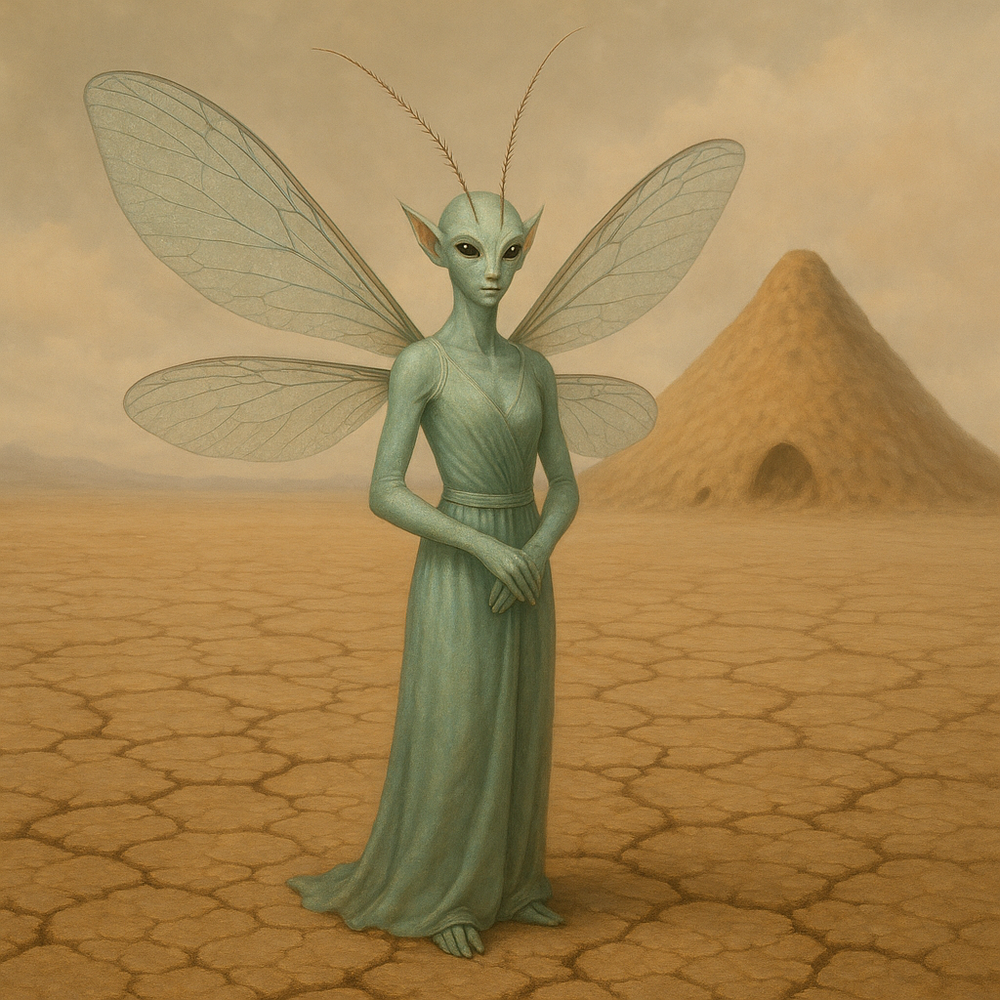

## Velinth

### Description:

The Velinth are elegant, delicate beings whose slender bodies are borne aloft on gossamer insect wings that catch the light in shifting rainbows. Fine and gracile, they move with a fluttering lightness, and from their brows rise a pair of long, feathery antennae that are forever in gentle motion, tasting the air for far more than scent. For the antennae of a Velinth sense emotion — the subtle chemical and electrical signatures of feeling that other beings exude without knowing it — making every Velinth, in effect, an unerring reader of the hearts around them.

This gift utterly defines Velinth society. Because no feeling can be hidden from them, deception is pointless and dishonesty transparent; a lie told to a Velinth announces itself in the liar's own emotional scent as surely as a shout in a quiet room. Over the ages this has forged a culture built on radical tact and scrupulous honesty, where the twin virtues of truthfulness and gentleness are prized above all others. The Velinth do not merely value honesty — they have no real alternative to it — and so they have made an art of speaking truth kindly, cushioning hard realities in grace so that honesty need never become cruelty.

Their emotional perception makes the Velinth extraordinarily empathetic and exquisitely considerate. A Velinth feels the discomfort it causes as keenly as the one who suffers it, and so they have evolved elaborate codes of courtesy designed to spare one another distress — careful phrasings, delicate silences, a thousand small kindnesses woven into the fabric of daily life. To cause needless emotional pain is, to the Velinth, a kind of self-inflicted wound, for the giver of hurt feels its echo as plainly as the receiver. Cruelty is therefore not merely forbidden among them but very nearly unthinkable.

Velinth communities are gentle, harmonious, and intricately mannered, governed by consensus and an abiding mutual consideration. They make exquisite diplomats and healers of the spirit, able to perceive and soothe troubles others cannot even name. Yet their sensitivity is also their burden: the raw, clashing emotions of less tactful species can overwhelm them, and a Velinth adrift in a crowd of angry or deceitful strangers suffers greatly. Among their own, however, they live in a serene and honest harmony that few other peoples can imagine.

### Notable Traits:

- Habitat: Flowered meadows, gardens, and gentle temperate groves
- Lifespan: 65 years
- Strength: Antennae that sense emotion, granting deep empathy and insight
- Weakness: Fragile and easily overwhelmed by harsh or hostile emotions
- Temperament: Gentle, tactful, and scrupulously honest

### Fun Fact:

A Velinth cannot be lied to, for a falsehood betrays itself in the speaker's own emotional scent — which is why their word for "liar" translates literally as "one who stinks of fear."

---

*"Speak the truth softly, for a kind truth heals where a cruel one wounds."* — Velinth proverb

[Back to Aliens](../aliens.md#velinth)
