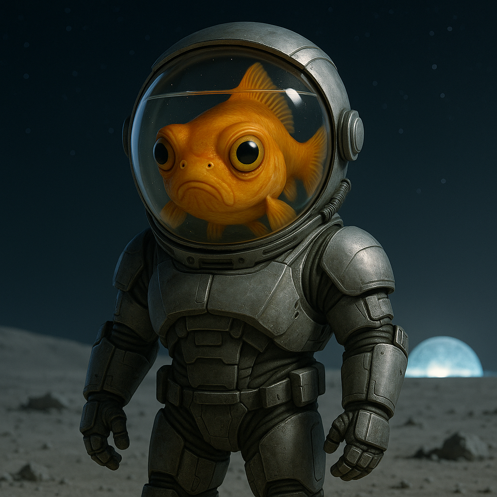

## Vessari

### Description:

The Vessari are a highly intelligent aquatic species from the deep oceanic world of Thalassa Prime, and at first glance they are deeply unimpressive: round, finned, gold-and-orange beings bearing an uncanny resemblance to the humble goldfish, their faces fixed in an expression of perpetual, mild disappointment. Behind those unassuming eyes, however, lies one of the most formidable engineering intellects in the known galaxy, a mind that treats every problem as a puzzle to be elegantly solved.

Having evolved on a world of unbroken ocean, the Vessari faced a predicament that would have grounded any lesser species forever: how does a creature with no limbs, no lungs, and no tolerance for dry land ever reach the stars? Their answer was pure Vessari genius — the Ambulatory Exploration Suit, a rugged humanoid exosuit crowned with a reinforced aqua-dome helmet that carries a slice of home ocean wherever its wearer goes. The suit reads the subtlest flick of a fin and the faint pulse of bioelectric signals, translating them into the stride of a walker and the grip of a builder's hand.

That single invention transformed the Vessari from ocean-bound philosophers into galactic engineers, and their culture reflects it at every level. They revere the Suitwrights who design and maintain the AES as others revere priests, and a Vessari's first suit is received in a coming-of-age ceremony as sacred as any rite. Patience and ingenuity are their cardinal virtues; they approach obstacles not with force but with careful, incremental cleverness, and they take quiet, grumpy pride in solving in an afternoon what others declared impossible for a century.

Vessari society is cooperative, meticulous, and faintly bureaucratic, governed by consensus among guilds of engineers, navigators, and life-support technicians. They are diplomatic by temperament, preferring negotiation to conflict, in no small part because every Vessari is acutely aware that its survival depends on a thin dome of glass between itself and a hostile dry universe. For all their famous grumpiness, they are generous collaborators and loyal allies, and they bristle only at the one insult they can never forgive: any joke about a three-second memory.

### Notable Traits:

- Habitat: Ocean worlds — anywhere else, inside an Ambulatory Exploration Suit
- Lifespan: 200+ years (the "3-second memory" rumor is, they insist, slanderous propaganda)
- Strength: Master engineers and endlessly patient problem-solvers
- Weakness: A cracked dome is a very bad day; utterly helpless without the suit
- Temperament: Famously grumpy-looking, but diplomatic and loyal

### Fun Fact:

Every Ambulatory Exploration Suit carries a backup water reserve the Vessari affectionately call "the spare bowl."

---

*"We did not conquer the stars. We simply refused to stay in the fishbowl."* — Ancient Vessari proverb

[Back to Aliens](../aliens.md#vessari)
