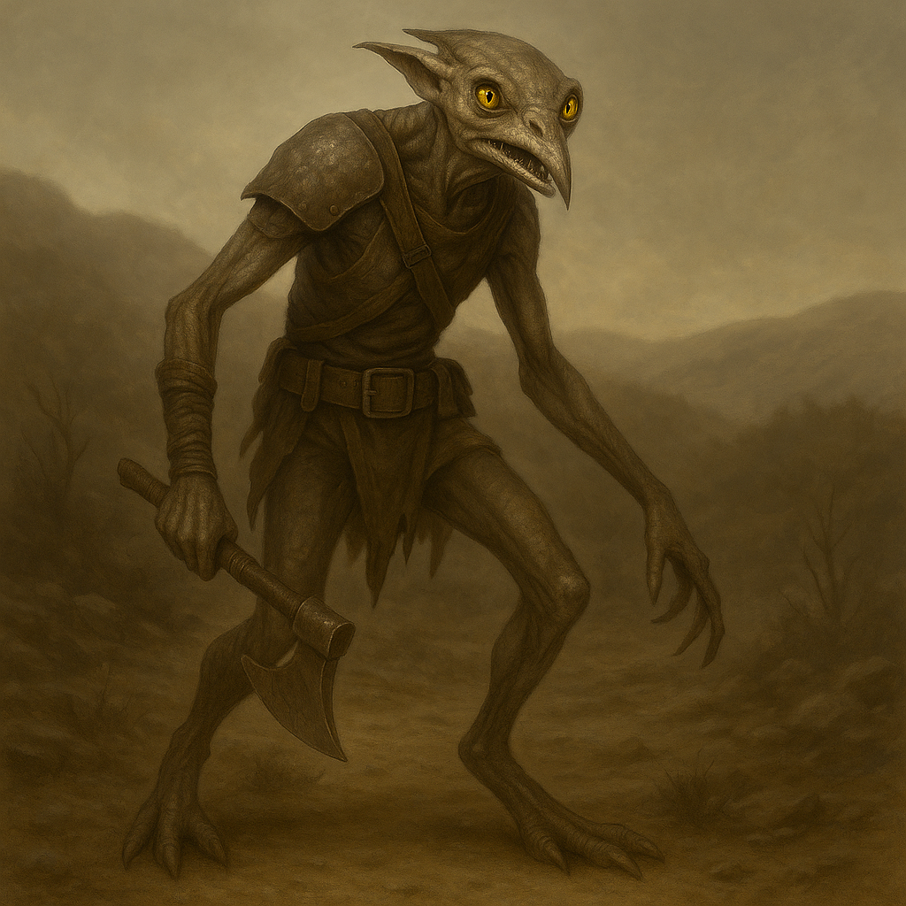

## Vexmire

### Description:

The Vexmire are lean, restless creatures all sinew and sharp angles, their mottled hides shifting between dun and ash to match whatever wild country they are passing through. Long-limbed and loose-jointed, they lope rather than walk, and their narrow faces are split by wide mouths full of small backward-curving teeth. Their eyes are a bright, acquisitive yellow, forever flicking toward the horizon as if measuring what lies just beyond it — and what might be taken from it. There is always a hunger about the Vexmire, not of the belly, but of ambition.

Vexmire culture is a culture of the frontier, forever pushing into the margins where law thins out and opportunity grows. They form loose, boisterous bands under whichever leader has most recently proven lucky and bold, and they prize the daring raid above all other achievements. Settlements are temporary things to the Vexmire — way-camps and staging posts rather than homes — because the Vexmire who stops moving is a Vexmire who has given up on the next, bigger prize. They are gamblers by temperament, cheerfully wagering lives and loot on long odds, and a band's songs are mostly tallies of the outrageous risks their heroes somehow survived.

Their aggression is opportunistic and expansionist, aimed less at glory than at gain. A Vexmire raid strikes where the pickings are richest and the defenders weakest, melting away before a real army can respond, then reappearing somewhere nobody expected. Yet they are not fools throwing themselves at walls — a Vexmire who sees a fight turning sour will break off without a shred of shame, for among them survival to raid another day is cunning, not cowardice. Their calculation is that of the opportunist: strike fast, grab much, risk everything on a good bet, but never on a bad one.

### Notable Traits:

- Habitat: Shifting frontier way-camps on the edges of settled lands
- Lifespan: 65 years
- Strength: Lightning raids, mobility, and a nose for undefended wealth
- Weakness: Poor at holding what they seize; bands scatter under real pressure
- Temperament: Aggressive and expansionist, but opportunistic and quick to disengage

### Fun Fact:

A Vexmire band measures its leader's worth in a single number — the ratio of plunder carried home to kin never carried back — and will replace a chief who lets that figure slip.

---

*"The horizon owes us everything, and we are here to collect."* — Vexmire raiding-song

[Back to Aliens](../aliens.md#vexmire)