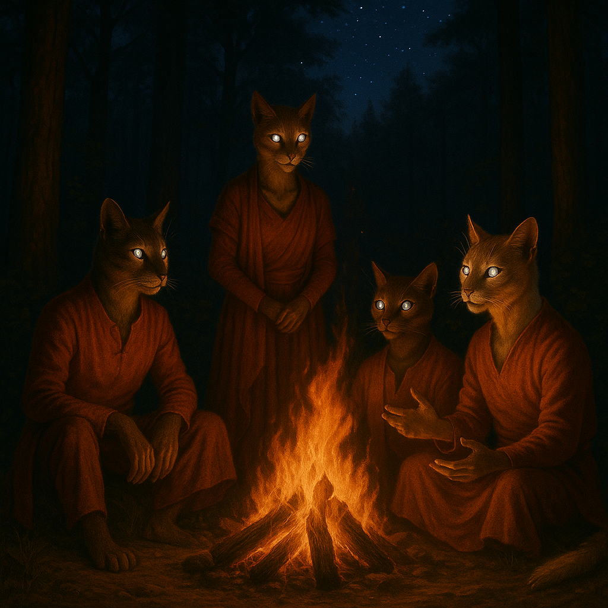

## Vezmara

### Description:

The Vezmara are an elegant, feline people, sleek and sinuous, with lithe muscled bodies, retractable claws, and great reflective eyes that flash gold and green in the dark like twin coals catching a stray beam. Every movement they make is unhurried and deliberate, possessed of a studied grace that can tip in a heartbeat into explosive speed, and they carry themselves with the serene self-possession of a people who have never once doubted their own worth. Vanity, in a Vezmara, is not a flaw but very nearly a virtue; they groom meticulously, dress with severe style, and regard a shabby appearance as a kind of moral failing.

Theirs is a culture that worships independence. The Vezmara prize self-reliance above almost every other quality, raising their young to hunt and think and survive alone, and they regard the clinging, crowded togetherness of other peoples with faint, polite distaste. A Vezmara keeps its own counsel, walks its own road, and bristles at any authority that presumes to command rather than persuade it. Their settlements are loose confederations of fiercely autonomous households, and even their closest alliances are understood to last precisely as long as they remain mutually agreeable — a Vezmara's loyalty is real but it is never owned.

And yet, for all their solitary pride, the Vezmara are not cold, and the proof of it comes with the night. When the stars wheel out across a clear sky, these aloof and self-contained creatures gather — drawn as if by instinct — to tell stories beneath the dark. Their storytelling is an elaborate art, half performance and half ritual, in which tellers vie through long velvet hours to spin tales of ancestors, of great solitary deeds, of love found and nobly relinquished. The firelit night-telling is the one time the independent Vezmara willingly bare their hearts to one another, and a people who will not take an order from anyone will sit for hours, rapt and purring softly, to hear a master-teller unspool a tale. In this way their fierce individualism and their deep need for connection find their single, nightly reconciliation.

### Notable Traits:

- Habitat: Open grasslands, savannas, and rocky uplands under clear skies
- Lifespan: 100–130 years
- Strength: Swift, agile, and keen-eyed in darkness; brilliant storytellers
- Weakness: Proud and solitary; resist cooperation and chafe under authority
- Temperament: Aloof, elegant, and fiercely independent

### Fun Fact:

A Vezmara will accept almost any insult but one — call its storytelling dull, and you have made an enemy for life.

---

*"Walk alone by day if you must, but no one should have to face the stars without a story."* — Vezmara night-telling refrain

[Back to Aliens](../aliens.md#vezmara)
