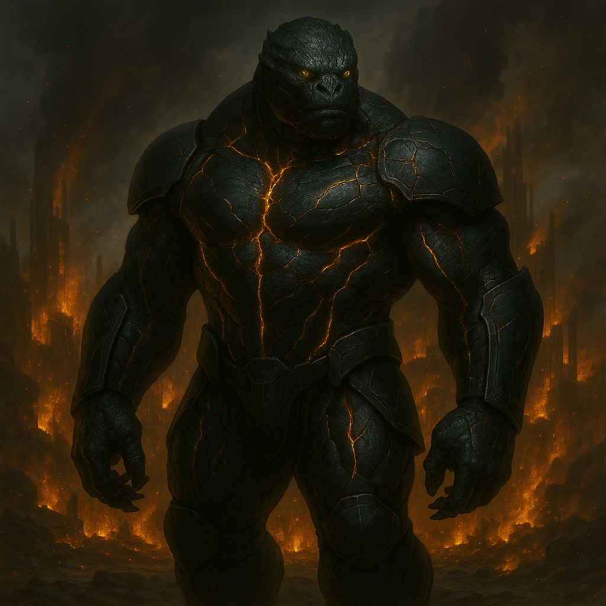

## Vhaal'Mir

### Description:

The Vhaal'Mir are, by the grim consensus of every people who have met them and survived, the most total expression of ambition the known reaches have ever produced. Towering and obsidian-scaled, their bodies are a seamless marriage of grown muscle and self-forged armor, lit from within by seams of molten gold that trace the lines of a physiology engineered across millennia for one purpose: to want everything, and to take it. They do not tire, they do not hesitate, and they do not, under any circumstance anyone has recorded, stop.

Vhaal'Mir civilization is a single, roaring engine of conquest that refuses to specialize because it refuses to accept any limit at all. They are peerless warriors and tireless colonizers; their forge-worlds out-produce whole alliances while their trade-fleets strip the wealth from a dozen systems; they reinvent their own methods between one campaign and the next, and they gamble entire war-hosts on strokes so audacious that lesser peoples mistake their boldness for madness until the dust clears and the Vhaal'Mir are simply there, triumphant. Where other species pick a path — the merchant, the builder, the raider, the explorer — the Vhaal'Mir are contemptuous of the very idea of choosing. Why be one thing, their philosophers ask, when the universe is offering all of it? Beneath this ferocity runs a cohesion that is almost serene: every Vhaal'Mir pours itself utterly into the collective ascent, with no faction, no hoarding, no dissent, a billion wills fused into a single advancing purpose.

What they will not do — the one capability they have deliberately, proudly amputated from themselves — is negotiate. The Vhaal'Mir regard diplomacy as the confession of a people who have already decided they cannot simply win, and they would sooner be destroyed than make that confession. Envoys are not received; treaties are not read; the word that other species translate as "compromise" is, in the Vhaal'Mir tongue, the same word as "defeat," and it is the only obscenity their language possesses. They do not threaten and they do not bluster, because threat and bluster are themselves a kind of bargaining. They simply arrive, in overwhelming force and overwhelming number, having already built, bought, bred, and dared their way to the edge of your world — and the only question they have ever been interested in asking is how quickly you will understand that the asking is over.

### Notable Traits:

- Habitat: Everywhere they have reached, which is a great deal, and growing
- Lifespan: 300 years of unbroken ambition
- Strength: Supremacy in war, industry, commerce, expansion, and daring alike — bound by flawless unity
- Weakness: Constitutionally incapable of diplomacy or compromise; they can only escalate
- Temperament: Overwhelming, implacable, and utterly uncompromising

### Fun Fact:

The Vhaal'Mir maintain no diplomatic corps whatsoever; the grand hall other empires reserve for receiving ambassadors is, in a Vhaal'Mir capital, simply another foundry.

---

*"Everything, or it was never worth wanting. And we have never once said 'enough.'"* — Vhaal'Mir ascension-creed

[Back to Aliens](../aliens.md#vhaalmir)
