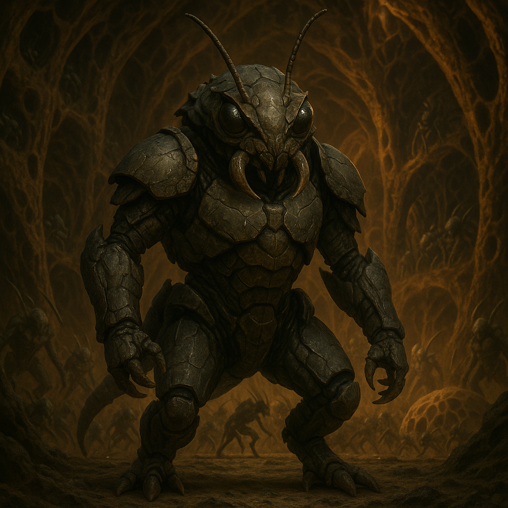

## Vorthak

### Description:

The Vorthak are a lean, chitinous people the color of old iron, their bodies segmented and tireless, built around a single overriding compulsion: to spread. Four blunt limbs carry them with a marching, metronomic gait, and their mouthparts are shaped less for speech than for the clipped, functional signals of a people who regard conversation as wasted motion. Where other species see a horizon, the Vorthak see only territory not yet claimed.

Vorthak civilization is organized entirely around the Expansion — a sacred, unending imperative to plant new colonies across every reachable world. They do not conquer for glory or wealth, but because an unsettled land is, to the Vorthak mind, an intolerable emptiness that must be filled. Each colony is expected to spawn two more before its founders die, and a Vorthak who dies without having seeded new ground is quietly erased from the lineage-records, as though they had never existed. Their sprawling hive-states metastasize outward in every direction, and they measure a generation's worth not in art or knowledge but in the number of new biodomes planted beneath new suns.

Diplomacy is alien to them in the most literal sense. The Vorthak possess no concept of a border they are obliged to respect, no notion of a neighbor whose claims matter. Envoys are met with blank incomprehension or brusque dismissal; the Vorthak will not negotiate for land any more than a tide negotiates with a shore. They are not cruel, exactly — they simply do not register other peoples as obstacles worth addressing, only as features of a landscape soon to be overrun. When the Vorthak come, they come as a flood, and floods do not parley.

### Notable Traits:

- Habitat: Everywhere they can reach — the more worlds the better
- Lifespan: 70 years of ceaseless colonization
- Strength: Explosive, relentless colonial expansion
- Weakness: Blunt and uncomprehending; cannot or will not negotiate
- Temperament: Driven, encroaching, and coldly single-minded

### Fun Fact:

A Vorthak greeting and a Vorthak declaration of annexation are the same gesture — a fact that has started more wars than any insult.

---

*"The empty land is an accusation. We answer it the only way we know."* — Vorthak Expansion-creed

[Back to Aliens](../aliens.md#vorthak)
